# Who is talking

## utku turk

::: {.columns}
::: {.column width="60%"}

:::
::: {.column width="40%"}
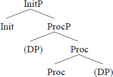{width="62%"}
:::
:::

::: footer
Bogazici University, Istanbul
:::

## The key to the cabinets are rusty

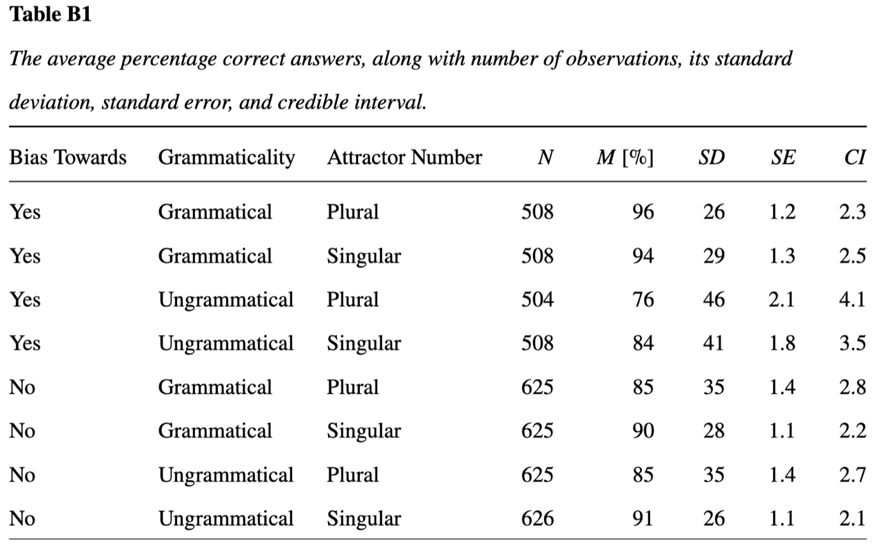{width="80%"}

::: footer
Agreement attraction
:::

## The key to the cabinets are rusty

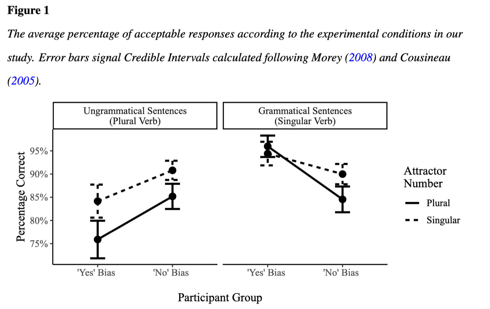{width="72%"}

::: footer
Agreement attraction
:::

## task effects

::: {.columns}
::: {.column width="48%"}
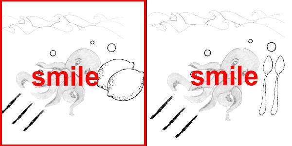
:::
::: {.column width="52%"}
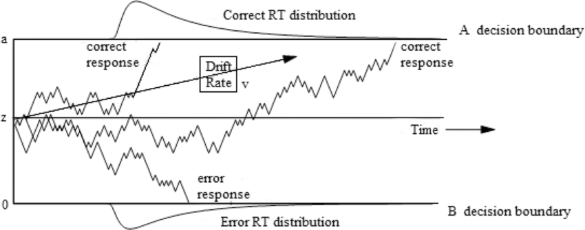
:::
:::

## task effects

::: {.columns}
::: {.column width="55%"}
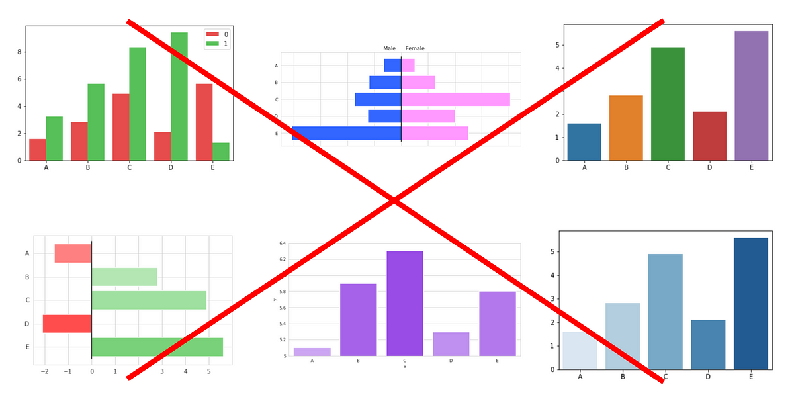
:::
::: {.column width="45%"}
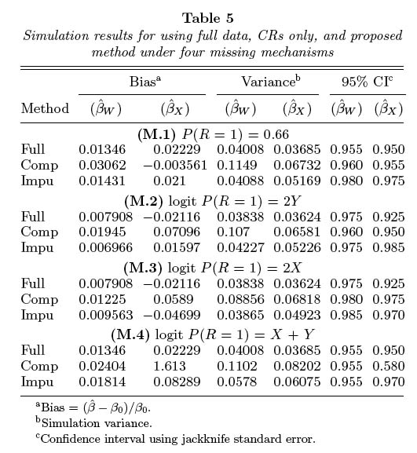{width="78%"}
:::
:::

## haute couture

::: {.gallery}
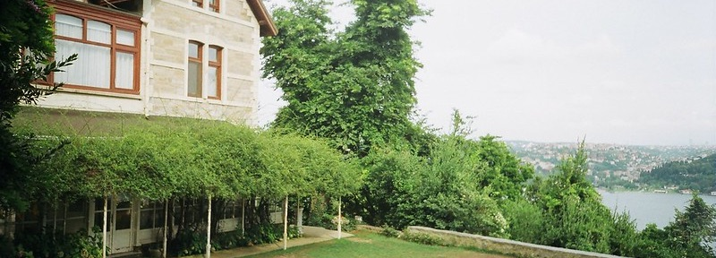

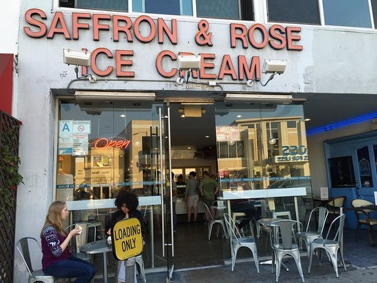

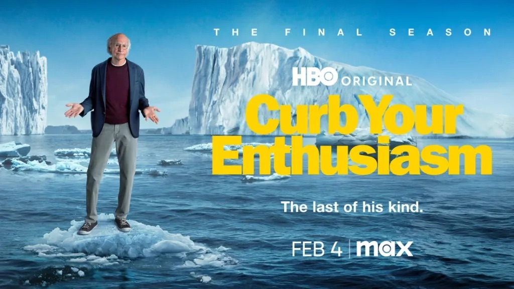

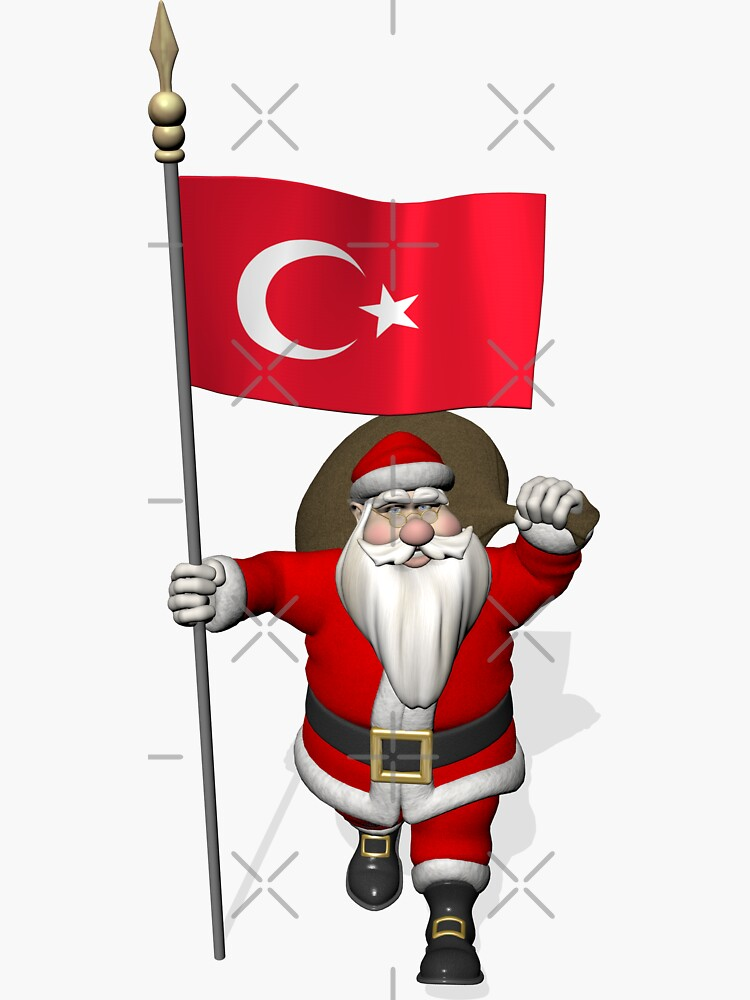
:::

## haute couture

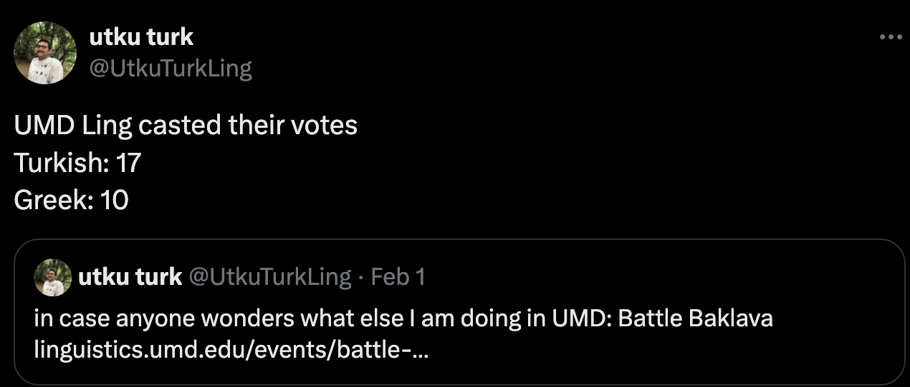{width="62%"}

## haute couture

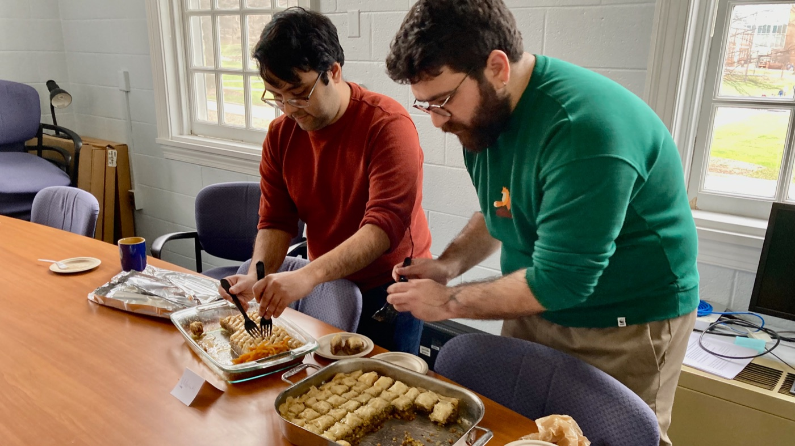{width="76%"}

# I really like surveys

## I really like surveys {.smaller}

::: {.columns}
::: {.column width="58%"}
- Did you check the syllabus?

::: {.fragment}
- **BQ**: send a question for the reading
:::

::: {.fragment}
- **Syntheses**: half a page, reflecting on questions
  - [Why speech cannot be reverse of listening???]{.quiet}
:::

::: {.fragment}
- **Presentation**: choose a paper and present it
:::

::: {.fragment}
- **Project**
  - [Do you change your way of speaking as a function of listeners?]{.quiet}
:::
:::
::: {.column width="42%"}
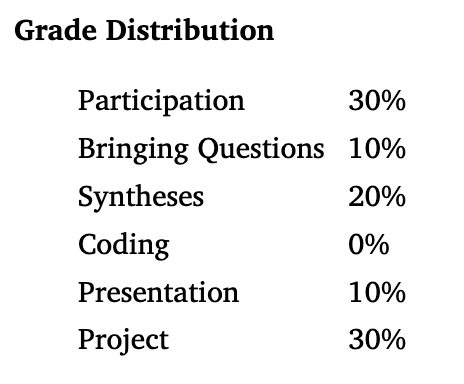
:::
:::

## I really like surveys {.smaller}

- Did you check the syllabus?

::: {.fragment}
- Email me in advance if you cannot make it
:::

::: {.fragment}
- Same for assignments
:::

::: {.fragment}
- Valid excuse example:
  - [I was out drinking and couldn't work sorry.]{.quiet}
:::

::: {.fragment}
- Also if you did not understand something
:::

::: {.fragment}
- Also if you saw something funny or had a cool idea
:::

::: {.fragment .claim}
[utkuturk@umd.edu](mailto:utkuturk@umd.edu)
:::

## I really like surveys {.smaller}

::: {.columns}
::: {.column width="55%"}
- Did you check the syllabus?

::: {.fragment}
- I beg you not to send AI slop
:::

::: {.fragment}
- I really do not care about a perfect answer, or presentation, or idea.
:::

::: {.fragment}
- What I want to see? Annoyance, anger, frustration, admiration, love, inspiration, etc.
:::
:::
::: {.column width="45%"}
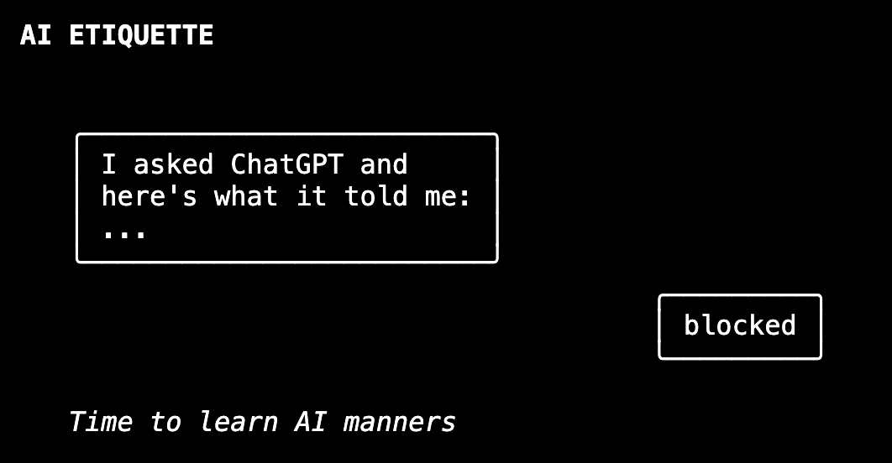
:::
:::

## I really like surveys

- Did you check the syllabus?

::: {.fragment}
- Please be respectful to each other
  - [Which includes giving everyone the benefit of the doubt, especially when
    you disagree with each other.]{.quiet}
:::

## I really like surveys

- Did you check the syllabus?

::: {.fragment .prompt}
Question about the syllabus?
:::

# What do we all care about

## I really like surveys

- Did you check the syllabus?

::: {.fragment .prompt}
Linguistics background?
:::

::: {.fragment .prompt}
Why should anybody care about language production?
:::

::: {.fragment .prompt}
Why should anybody care about morphology or words?
:::

::: {.fragment .prompt}
What do I care about?
:::

::: {.fragment .prompt}
What do you all care about?
:::

## For Wednesday

::: {.claim}
Read **Griffin & Ferreira (2006)** up to **1.3, Generating function words and
morphemes** (roughly page 15).
:::

::: {.fragment}
Send me one question about it before class.
:::

::: footer
The reading is on ELMS.
:::
