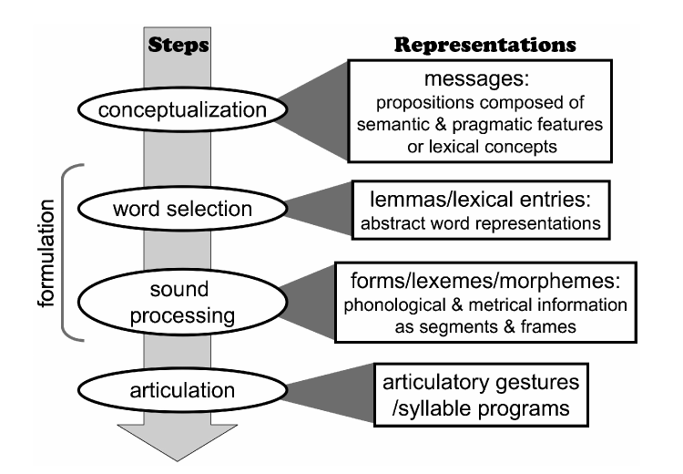
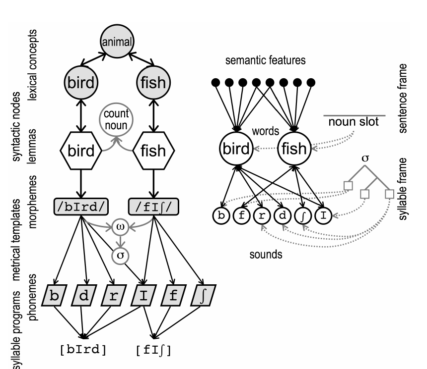

## Where we are

- What we want:  **how complex words get built while you are talking**.

::: {.fragment}
- We need a core piece: how a *single, simple* word gets out of your mouth.
:::

::: {.fragment}
- Let's write down your questions first.
:::


::: footer
Course schedule, Week 1
:::


# First, a game

## Describe this picture {.demo}

::: {.stim}
::: {.pic}
🐌 🍃
:::
:::

::: {.fragment}
Write down random six words come to your mind.
:::

::: {.fragment}
- Nobody in this room wrote the same six words.
:::

::: {.fragment}
- It is clear that first two all of you shared: snail and leaves. but then?
:::


## Speaking is not listening, reversed

- Recognizing a word in your native language is fast, automatic, and needs no intention.
+ Producing the *same* word needs an intention and takes up to five times longer.

::: {.fragment}
::: {.claim}
Listeners start looking at the referent **before** the speaker has finished
saying the word. Speakers need about **900 ms** to start naming a pictured
object.
:::
:::

::: {.fragment}
Which is roughly how long it took you to get going on the snail.
:::

::: footer
Tanenhaus et al. 1995; Snodgrass & Yuditsky 1996
:::

## Keep in mind that

- Almost everything in this chapter is about **single, isolated utterances**.
  We set conversations, narratives, turn taking aside for a second.
- Almost everything is about **nouns**.

::: {.fragment .prompt}
I want you to keep on asking if any of this would easily survive in other situations?
:::

::: footer
Levelt 1989; Clark 1996
:::

## The three steps

What are the 'steps' the chapter discusses?

## The three steps
:::: {.columns}
::: {.column width="45%"}
- **Conceptualization**, decide what to express
- **Formulation**, decide how to express it
- **Articulation**, say it
:::
::: {.column width="55%"}

:::
::::

::: footer
Levelt 1989. Figure 1, Griffin & Ferreira 2006:22
:::


## Properties in the chapter

- Property 1, the steps
- Properties 2 to 9, from meaning to word
- Properties 10 to 13, assembling the sounds
- Properties 14 and 15, how it all plays out in time

::: {.fragment}
For today: we stop at Property 8, at the end of section 1.2.
:::

::: {.fragment .aside}
Models disagree less than you would expect. They mostly agree on the facts and
differ on the mechanism, and on which stage they bothered to model.
:::

# 1.1 Word selection precedes sound assembly

## Property 1

::: {.claim}
Speakers access words by meaning first, then work on the sounds.
:::

Two kinds of evidence:

::: {.fragment}
1. **Speech errors** come in types, and the types line up with the steps.
2. **Time course** in picture and word interference.
:::

::: footer
Fromkin 1971; Garrett 1975
:::

## Errors come in types {.smaller}

| Error type | Example |
|---|---|
| Semantic word substitution |  |
| Blend |  |
| Phonological word substitution |  |
| Morpheme substitution |  |
| Sound substitution |  |

::: footer
Table 1, Griffin & Ferreira 2006:24
:::


## Errors come in types {.smaller}

| Error type | Example |
|---|---|
| Semantic word substitution | "give him the **yel**- er the **pink** ... the *green* jersey" |
| Blend | "**Justi:ce**, *Justin and Travis*" |
| Phonological word substitution | "the battle for the green **journey** [*jersey*]" |
| Morpheme substitution | "an awful lot of use**less** information. use*FUL* information" |
| Sound substitution | "the **raid**, uh, the *roadie* is accepting..." |

::: footer
Table 1, Griffin & Ferreira 2006:24
:::

## Errors come in types

::: {.aside}
Most of the examples in Table 1 come from one cycling commentator at the 2005
Tour de France. Talking fast for six hours a day is very good for error corpora.
:::

- Corpora like this are **opportunistic**. You get what people happen to say.
- The rates are low: roughly 2.5 word errors and 1.5 sound errors per 10,000
  words of running speech.

::: {.fragment .prompt}
Which errors do you think are *undercollected*, and why would that matter?
:::

::: footer
Deese 1984; Fromkin 1971
:::

## Why the types matter

::: {.fragment}
- You can pick the **wrong word** and pronounce it perfectly.
:::
::: {.fragment}
- You can pick the **right word** and scramble its sounds.
:::
::: {.fragment}
- Those are two different failures, so there are two different steps.
:::

::: {.fragment .prompt}
Notice the fourth row. *Morphemes* substitute too, and they substitute
separately from the stem. Hold onto that one.
:::

# Now we are going to run an experiment on you

## The rules {.demo}

::: {.rules}
1. A picture appears. **Say its name out loud, immediately.**
2. A word will appear on top of it. **Ignore the word.**
3. Do not think very hard.
:::

::: footer
Picture and word interference: Schriefers, Meyer & Levelt 1990
:::


## Practice {.demo}

::: {.stroop}
::: {.fragment .fade-in-then-out .ink-blue}
RED
:::
::: {.fragment .fade-in-then-out .ink-green}
BLUE
:::
::: {.fragment .fade-in-then-out .ink-purple}
GREEN
:::
::: {.fragment .fade-in-then-out .ink-orange}
PURPLE
:::
::: {.fragment .fade-in-then-out .ink-red}
ORANGE
:::
:::


## Practice 2 {.demo}

::: {.stim}
::: {.fragment .word}
CLOUD
:::
::: {.pic}
🪑
:::
:::

## Website

https://www.utkuturk.com/pwi

## Which one hurt? {.demo}


## The same trial, on a timer

::: {.soa}
::: {.soa-track}
::: {.soa-pic}
picture
:::
::: {.soa-word}
distractor
:::
:::
::: {.soa-axis}
[-400 ms]{.t1} [-200]{.t2} [0]{.t3} [+200]{.t4} [+400]{.t5}
:::
:::

The time you introduce the distractor directly affects which step it interferes with.

::: footer
Schriefers, Meyer & Levelt 1990; Glaser & Düngelhoff 1984
:::

## What people previously found (idealistic)


```{r}
#| label: setup
#| echo: false

library(ggplot2)
library(dplyr)
library(tidyr)

set.seed(1990)

theme_set(
  theme_minimal(base_size = 18) +
    theme(
      panel.grid.minor = element_blank(),
      legend.position = "top",
      plot.subtitle = element_text(colour = "grey30", size = 14)
    )
)

cols <- c(Semantic = "#B2182B", Phonological = "#2166AC")
cols3 <- c(cols, Unrelated = "grey45")

lvls <- c("Semantic", "Unrelated", "Phonological")

# one dodge object for every layer in every plot;
# 30 ms total width across 3 groups = 10 ms between adjacent points
pd <- position_dodge(width = 30)

n_subj <- 24
baseline_rt <- 620

# true effects in ms, relative to the unrelated baseline
cell_means <- expand.grid(
  soa = c(-150, 0, 150),
  condition = c("Unrelated", "Semantic", "Phonological"),
  stringsAsFactors = FALSE
)
cell_means$effect <- c(
  0,
  0,
  0, # Unrelated
  32,
  8,
  -2, # Semantic:     interference early, gone late
  -3,
  -28,
  -22 # Phonological: nothing early, facilitation late
)

subj_int <- rnorm(n_subj, 0, 45)

dat <- merge(cell_means, data.frame(subject = 1:n_subj))
dat$rt <- baseline_rt +
  dat$effect +
  subj_int[dat$subject] +
  rnorm(nrow(dat), 0, 18)
```


```{r}
#| label: diff-plot
#| echo: false

diffs <- dat |>
  select(subject, soa, condition, rt) |>
  pivot_wider(names_from = condition, values_from = rt) |>
  transmute(
    subject,
    soa,
    Semantic = Semantic - Unrelated,
    Phonological = Phonological - Unrelated,
    Unrelated = 0
  ) |>
  pivot_longer(
    c(Semantic, Phonological, Unrelated),
    names_to = "condition",
    values_to = "effect"
  )

summ <- diffs |>
  group_by(soa, condition) |>
  summarise(m = mean(effect), se = sd(effect) / sqrt(n()), .groups = "drop") |>
  mutate(
    lo = m - 1.96 * se,
    hi = m + 1.96 * se,
    condition = factor(condition, levels = lvls)
  )

summ <- summ %>% filter(condition != "Unrelated")

ggplot(summ, aes(soa, m, colour = condition, group = condition)) +
  geom_line(linewidth = 1, position = pd) +
  geom_errorbar(
    data = filter(summ, condition != "Unrelated"),
    aes(ymin = lo, ymax = hi),
    width = 0,
    linewidth = 1.5,
    position = pd
  ) +
  geom_hline(yintercept = 0, linetype = "dashed") +
  geom_point(size = 3.5, position = pd) +
  scale_x_continuous(breaks = c(-150, 0, 150)) +
  scale_colour_manual(values = cols3) +
  labs(
    x = "SOA (ms)",
    y = "Related minus unrelated (ms)",
    colour = NULL,
    subtitle = "Above zero = interference. Below zero = facilitation."
  )
```

- Two stages, and two separate levels of representation: word level and
  sound level.


::: footer
Glaser & Düngelhoff 1984; Damian & Martin 1999; Starreveld 2000
:::


# 1.2 Selecting a content word

## Property 2: a web of words

::: {.fragment}
- Semantic substitutions: calling a van *bus*.
- Blends: *behavior* plus *deportment* gives **behortment**.
:::

::: {.fragment}
::: {.claim}
Of course, we fail at selecting the 'exact' word.
:::
:::

::: {.fragment}
Which raises the obvious question: what *is* a meaning, in these models?
:::

::: footer
Dell et al. 1997; Garrett 1975; Wells 1951/1973
:::

## Two possibilities

:::: {.columns}
::: {.column width="50%"}
**Non-decompositional**

`BIRD` is one atomic lexical concept.

Neighbours come from links in a network: `BIRD` to `ANIMAL` to `FISH` to *fish*.
:::
::: {.column width="50%"}
**Decompositional**

`bird` = HAS WINGS, HAS FEATHERS, SINGS SONGS.

Neighbours come from shared features: airplanes have wings, opera singers sing.
:::
::::

::: footer
Fodor 1975; Roelofs 1992; Levelt et al. 1999 (left). Dell 1986; Vigliocco et al. 2004 (right)
:::

## Two possibilities

{width="78%"}

::: footer
Figure 2, Griffin & Ferreira 2006:27. WEAVER++ (Levelt et al. 1999) left, Dell et al. (1997) right.
:::

## Two possibilities

- Decompositional gets similarity for free: overlap in features.
- Non-decompositional has to build similarity out of network links.
- Both have to explain why the neighbourhood is **context dependent**. Blends
  only involve words that are interchangeable *in that sentence*.

::: {.fragment .prompt}
For us: if a morpheme carries meaning, which of these two boxes does *-ed* go
in? Does `PAST` have features? (Look at Kandel & Pañeda et al. 2025)
:::

::: footer
Garrett 1975; Levelt 1989
:::

## Property 3: similar meanings compete

- Words that intrude in substitutions share grammatical class, taxonomic
  category, and level of specificity with the target.
- Related distractors slow you down relative to unrelated ones.

::: {.fragment}
::: {.claim}
But sometimes *dog* and *bone* do not compete. Why?
:::
:::

::: footer
Fromkin 1971; Nooteboom 1973; Cutting & Ferreira 1999; Lupker 1979
:::

## How models make words compete

- **Activation only.** Probability of selection tracks activation. Enough for
  error patterns, not enough for latencies.
- **Lateral inhibition.** The more active a word is, the harder it pushes the
  others down. Time to threshold is your reaction time. Kind of a race.
- **WEAVER++.** Two factors: a ratio of the target's activation to everything
  else in the response set, plus a **critical difference** the target has to
  clear.

::: {.fragment .aside}
That last one makes a real prediction: one strong competitor is worse than two
half strength ones.
:::

::: footer
Dell 1986; Cutting & Ferreira 1999; Harley 1993; Levelt et al. 1999; Luce 1959
:::

## Property 3, a small case: codability

- *tooth*, *bomb*: one dominant name, so fast.
- *TV* or *television*, *weights* or *barbells*: two good names, so slow.


::: footer
Lachman 1973; Lachman, Shaffer & Hennrikus 1974
:::

## Property 4: fenced in by grammatical class

::: {.fragment}
- Nouns substitute for nouns, verbs for verbs.
  - What about interchangable words?
  - What about theories that says words are categoriless?
:::
::: {.fragment}
- Distractors interfere when they share grammatical class, verb transitivity,
  and other context relevant syntactic features.
:::
::: {.fragment}
- Even purely *phonological* substitutions tend to keep the category.
:::

## Property 4: one possible takeaway

::: {.fragment}
::: {.claim}
The pressure to keep the grammatical class is **stronger** than the pressure to
keep the meaning.
:::
:::

::: {.fragment}
This is the first place syntax enters the model, and it enters as a frame with
slots: a noun slot only accepts nouns.
:::

::: footer
Fromkin 1971; Garrett 1975; Schriefers 1993; Fay & Cutler 1977
:::

## Property 5: which meanings are easy
::: {.fragment}
- **Imageability and concreteness.** *vampire, wind, pine* beat *fear, sense,
  spirit*.
:::
::: {.fragment}
- **Predictability.** The more predictable a word is in context, the fewer
  pauses and *um*s before it, and the faster the naming.
:::

::: {.fragment}
::: {.claim}
The twist: imageable words are produced faster **and** are more likely to be
replaced by a semantically related word.
:::
:::

::: {.fragment}
Richer meaning helps you find the word, and gives you more neighbours to trip
over.
:::

::: footer
Morrison et al. 1997; De Groot 1989, 1992; Griffin & Bock 1998; Goldman-Eisler 1958
:::

## Property 5: exercise

- How can we explain these effects with decompositional or atomic meaning models?

## Property 6: looking is not naming

- Distractor **word** *banana* while you say *apple*, that is interference.
- Distractor **picture** of a banana while you say *apple*, that is
  **facilitation**.

::: {.fragment}
::: {.claim}
Words seem to get activated only when you intend to talk about the thing.
Objects on their own do not push you into the lexicon.
:::
:::

::: {.fragment .aside}
Speakers even look right at an object while deliberately naming it wrong
(Griffin & Oppenheimer 2003).
:::

::: footer
Bloem & La Heij 2003; Damian & Bowers 2003
:::

## Property 6: except it is not clean

- Ignored objects show **no** semantic interference.
- But they *do* speed you up when their name sounds like your target, *cap*
  while naming a *cat*.

::: {.fragment}
What does this suggest?
:::

::: {.fragment}
::: {.claim}
Every model routes phonology through the lemma. So if you got phonology from the
ignored object, the lemma was active. And then where is the semantic interference?
:::
:::

::: footer
Morsella & Miozzo 2002; Navarrete & Costa 2005
:::

## Property 7: selection leaves a trace

- Repetition priming for object naming lasts **months**.
- Perseveration: name a zebra, then call the giraffe *zebra*.
- Semantic homogeneity: naming many animals in a row gets slower.

::: {.fragment}
- None of this happens if you just read the word aloud or categorize it. You
  have to **select** it from a meaning.
:::

::: {.fragment}
::: {.claim}
Reading, phonological assembly, and sentence production all have learning
models. Word production does not. The authors name this as a gap.
:::
:::

::: footer
Cave 1997; Bartram 1974; Vitkovitch & Humphreys 1991; Vigliocco et al. 2002
:::

# One more experiment. This one works on about half the room.

## Do not say it out loud {.demo}

::: {.question}
What is the name of that tall guy who plays in Frankenstein?
:::

::: {.fragment .rules}
If you have it, sit on it. If you are don't remember it, raise your hand.
:::

## Hands up, answer these {.demo}


::: {.rules}
1. What letter does it start with?
2. How many syllables?
3. What does it rhyme with?
4. Would you know it if I said it?
:::


## Property 8: stopping halfway

Tip of the tongue. You have the word and you cannot say it.

::: {.fragment}
What people can still know in a TOT state:

- its first letter or sound, its number of syllables, words it rhymes with
- whether it is count or mass
- its grammatical gender in
- which auxiliary the verb takes

Anomia after brain damage looks the same: gender preserved, form gone.
:::

::: footer
Brown & McNeill 1966; Burke et al. 1991; Vigliocco, Martin & Garrett 1999
:::

## What do we need for TOT in our models?

## Where the morphology is hiding

The chapter is about **content words**: nouns, mostly. Yet:

::: {.fragment}
- **Property 1.** Morphemes substitute in speech errors, on their own, away from
  their stems. *useless* for *useful*.
:::
::: {.fragment}
- **Property 4.** Grammatical class constrains selection harder than meaning
  does. Class is a morphosyntactic fact.
:::
::: {.fragment}
- **Property 8.** In a TOT you can report gender and count or mass status
  without the form. You are holding morphosyntax with no morphology attached.
:::

::: {.fragment}
Even for a "single" words that are seemingly "single" nodes we need
morphological information
:::

## Three questions to carry

::: {.prompt}
1. Every one of those observations is about a morpheme, and none of them get a
   mechanism in this chapter. Why not?
2. Is a compound one selection or two?
3. If Distributed Morphology is right and words are **built by syntax**, what
   happens to a stage called "word selection"?
:::

::: {.fragment .aside}
Section 1.3 starts to answer the first one. That is Thursday.
:::

## Key takeaways

1. Deciding what to say is its own step, and it is slow.
2. Meaning first, sounds second, and never a shortcut between them.
3. Selection is competitive, and the competition is over **similar meanings**
   inside the **same grammatical class**.
4. The word can succeed while its form fails. That is a TOT.
5. The models mostly agree on the facts. They differ on the mechanism.

## Bring questions

::: {.prompt}
- Property 1 says meaning based selection comes first. What would it look like if that was not the case ?
- Property 6: how would you tell "the word was never activated" apart from "the
  word was activated and then suppressed"?
- Name three things wrong with our experiment demo.
:::

::: footer
Reading questions due 11:59pm the night before
:::
