## What did earlier studies ask?

**Which words are hard to name? What kinds of errors occur?**

- **Frequency and age of acquisition:** mixed findings on whether errors are more frequent or earlier learned than targets.
- **Typicality:** people with semantic dementia often substitute a more typical category member (Woollams et al., 2008; Woollams, 2012).
- **Semantic features:** words with more features can be named faster and more accurately (Taylor et al., 2012; Rabovsky et al., 2016).

::: {.prompt}
But why say *pelican*, rather than *peacock*, for *flamingo*?
:::

::: footer
Earlier literature as reviewed in Lampe et al. 2024, pp. 19 to 22
:::

::: {.notes}
The target is the intended picture name; the error is the word actually
produced. Much earlier work asked how target properties affect naming time,
accuracy, or broad error categories. Some studies compared targets and errors
directly, especially for frequency, age of acquisition, and sound structure.
So target-error comparison is not itself new. The gap is the relatively
limited work on semantic properties of the particular incorrect response.

Typicality means how representative something is of its category. A robin is
a more typical bird than a penguin. Woollams and colleagues found greater
response typicalisation with greater semantic impairment; very mild
impairment did not show the same pattern. This raises a question about
whether time pressure in neurotypical speakers could produce a similar bias.

Semantic features are properties such as has wings, has feathers, and flies.
Earlier findings that feature-rich targets are easier to name motivate a new
question: do feature-rich words also win when they are the wrong response?
The paper notes inconsistent directions across the wider semantic-variable
literature; avoid presenting all previous naming studies as unanimous.
:::

## What can a wrong word tell us?

Someone sees **flamingo** but says **pelican**.

- **The activation account:** the representation of *pelican* became more strongly activated in the mental lexicon than the representation of *flamingo*.
- **The question:** which properties of the words, and of their relationship, could explain that activation pattern?
- **The approach:** compare targets and errors on psycholinguistic variables such as typicality, number of semantic features, and similarity.

::: {.claim}
Patterns in naming errors can help us infer how word knowledge is represented and activated during production.
:::

::: footer
Lampe et al. 2024
:::

::: {.notes}
This is the rationale for studying which wrong word was produced, rather
than only counting errors. On the authors' account, a substitution suggests
that the response's representation was more strongly activated than the
target's. Comparing the two words can identify properties that may contribute
to that difference and help explain why and how naming errors arise.

Activation is a theoretical explanation here, not a directly measured
quantity. The observed evidence is the relationship between targets and
responses. Systematic patterns constrain accounts of representation and
activation, but do not by themselves establish a causal mechanism or decide
whether lexical selection is competitive.
:::

## Task: speeded picture naming

**Show a picture → require a fast name → collect the mistakes.**

- A short response deadline produces more naming errors in neurotypical speakers.
- **Mirman (2011):** errors often came from the target's **near semantic neighbours**, more often than chance would predict.
- **Lampe et al.'s next question:** among possible wrong words, which semantic properties favour selection?

::: {.claim}
Being related to the target may get a word activated. What makes it win?
:::

::: footer
Moses et al. 2004; Mirman 2011, as reviewed in Lampe et al. 2024, pp. 18 to 22
:::

::: {.notes}
Use speeded naming as the methodological building block and Mirman's
target-error finding as the empirical starting point. Mirman examined both
aphasic picture naming and speeded naming by neurotypical participants.
Near neighbours were overrepresented despite their lower chance probability
relative to distant neighbours. That finding does not establish that the
very closest neighbour will be selected.

This paper analyses errors from an existing large experiment. Lampe et al.
2021 studied semantic effects on naming speed and accuracy in the first,
standard naming round. Lampe et al. 2023 compared those effects between
standard and speeded naming in the later rounds. The 2024 paper asks a
different question of the speeded responses: how does each particular error
relate to its intended target? These are not three independent replications.
See pp. 24 and 35, note 1.
:::

## Earlier evidence: neighbourhood effects {#mirman-evidence}

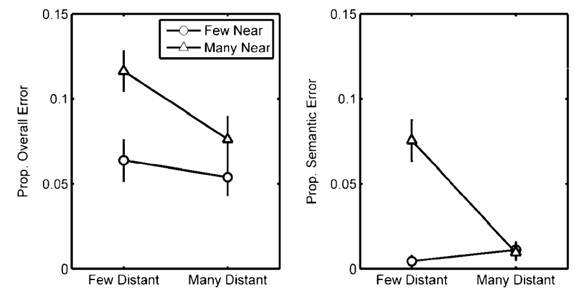{.nostretch .scientific-plot height=350 fig-alt="Mirman 2011 Figure 3: overall and semantic error proportions by few versus many near and distant semantic neighbours in speeded controls."}

**More near neighbours:** more errors. **More distant neighbours:** fewer errors overall.

::: footer
[Mirman 2011, Figure 3, p. 39](https://doi.org/10.3758/s13415-010-0009-7), original plot
:::

::: {.notes}
X groups targets by few or many distant neighbours; Y is errors divided by naming trials, for all errors on the left and semantic errors on the right.
Circles mean few near neighbours and triangles mean many; higher points mean more errors.
:::

## The logic: compare each error with its target {.smaller}

Related words become active together. An error shows which alternative was selected.

| Property | Comparison | Prediction |
|---|---|---|
| **Typicality** | How representative is the error of its category, relative to the target? | Error > target |
| **Number of features** | How many semantic properties does each word have? | Error > target |
| **Semantic similarity** | Is the error closer to the target than the target's near neighbours are, on average? | Error similarity > neighbour average |

Account for frequency, age of acquisition, familiarity, word length, imageability, and naming history.

::: footer
Lampe et al. 2024, pp. 22 to 23, 26 to 27
:::

::: {.notes}
The authors predict positive differences for all three measures. For
typicality and feature count, subtract the target value from the error
value. For similarity, subtract the target's average similarity to its near
neighbours from its similarity to the actual error. Zero means no difference
on the relevant comparison. Crucially, similarity is not compared with
unrelated words or with the target's similarity to itself.

Typicality is a family-resemblance score derived from shared category
features, not simply a participant's rating. Feature count comes from
feature-production norms and excludes taxonomic features. Similarity is
cosine overlap between feature vectors. Near neighbours have cosine
similarity greater than .4 in the database.

Each semantic difference is the outcome in its own mixed model. The
intercept tests the adjusted difference from zero; the other semantic
measures and control variables enter as covariates. Participant and item
random intercepts account for repeated observations. Naming history means
whether the response was produced previously and how many items from the
target's category had already appeared.

This is an analysis of naturally varying properties within elicited errors,
not an experimental assignment to high versus low typicality conditions.
:::

## Materials

- **78 participants** analysed: native Australian English speakers.
- **297 colour photographs** of objects, with high name agreement (>75%).
- **McRae et al. (2005) norms:** semantic features for calculating all three measures.
- Six presentation lists; at least two other-category pictures between pictures from the same category.

**Compare real-word errors with known target names.** Both words need the relevant norm data.

::: footer
Lampe et al. 2024, pp. 22 to 26
:::

::: {.notes}
83 people participated; five were excluded, leaving 78 aged 17 to 33.
The photographs had white backgrounds. High name agreement helps establish
what name the picture is intended to elicit.

Participants had already named these pictures once or twice without speed
pressure. Fourteen items with less than 60% accuracy in the second standard
naming round were excluded from the error analyses to reduce problems with
object identification or conceptual knowledge.

Not every mistake is analysable: the error must be a real word represented
in the norms. For the full similarity comparison, the target also needs at
least one near neighbour in the database. The database defines the available
comparison set; it is not an exhaustive inventory of a speaker's vocabulary.
:::

## Procedure: start speaking within 600 ms

**First:** standard naming. Then standard and speeded naming, in counterbalanced order.

**Practice:** picture + beep at 600 ms. Try to beat the beep.

**Experimental trial:**

::: {.claim}
Fixation (500 to 1000 ms) → picture (2000 ms, no beep) → speed feedback (400 ms) → blank (1000 ms)
:::

Say the first word that comes to mind. **Prioritize speed over accuracy.**

::: footer
Lampe et al. 2024, p. 24
:::

::: {.notes}
Distinguish the response-onset goal from picture exposure: 600 ms is the
deadline for beginning the response, not the duration of the experimental
picture. In practice, the picture disappears at 600 ms with a beep. In the
experimental trials, the picture remains for 2000 ms and there is no beep.
Feedback still reports whether the response began within 600 ms: Good!
or Too slow! It does not report whether the name was correct.

Five practice trials occurred at the start and after each of three breaks.
Speech was recorded, transcribed, and coded. The first full response was
used, including incorrect responses that speakers might later correct.
20% of responses were independently double-coded, with high agreement.
:::


## Pictures {#naming-preview .naming-preview data-autoslide=0}

```{=html}
<div class="naming-preview-grid">
  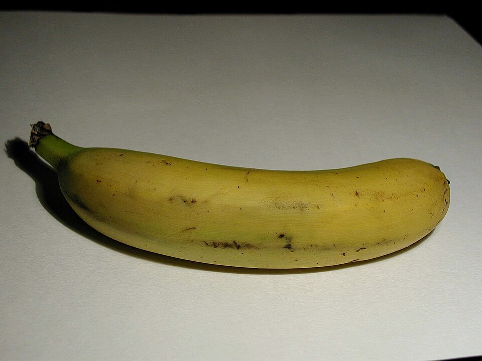
  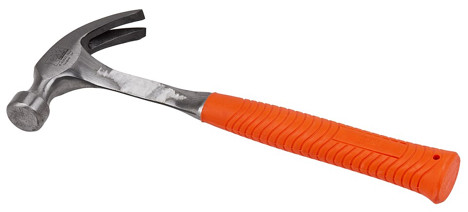
  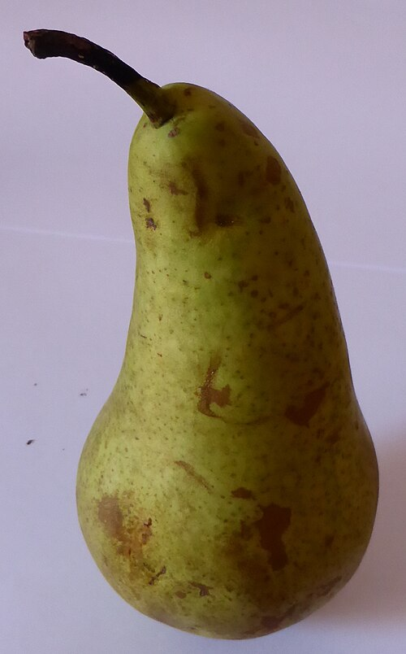
  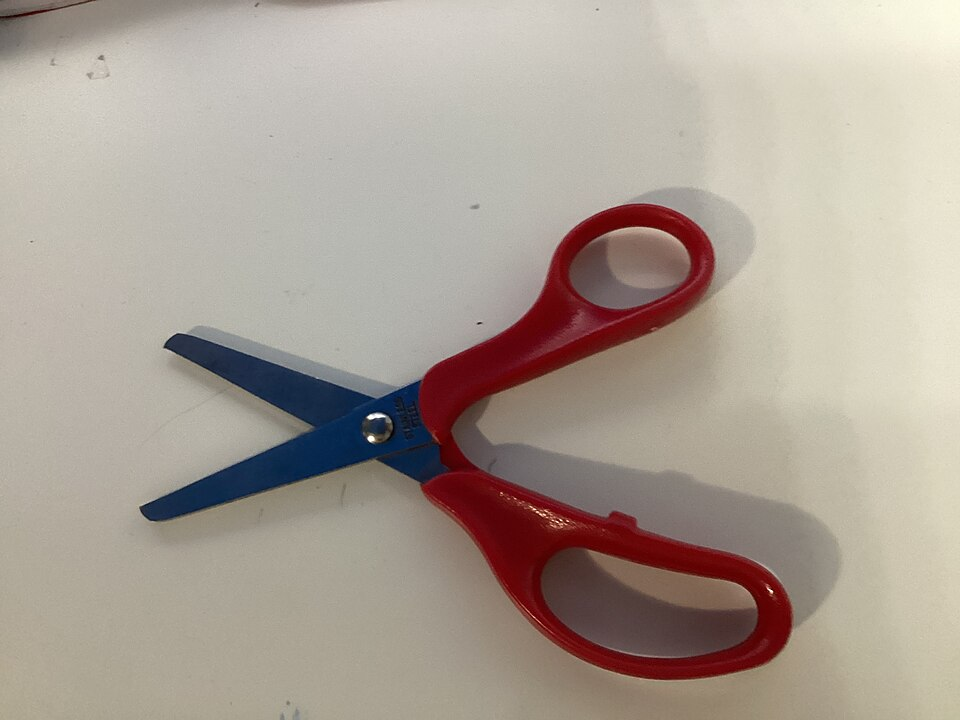
  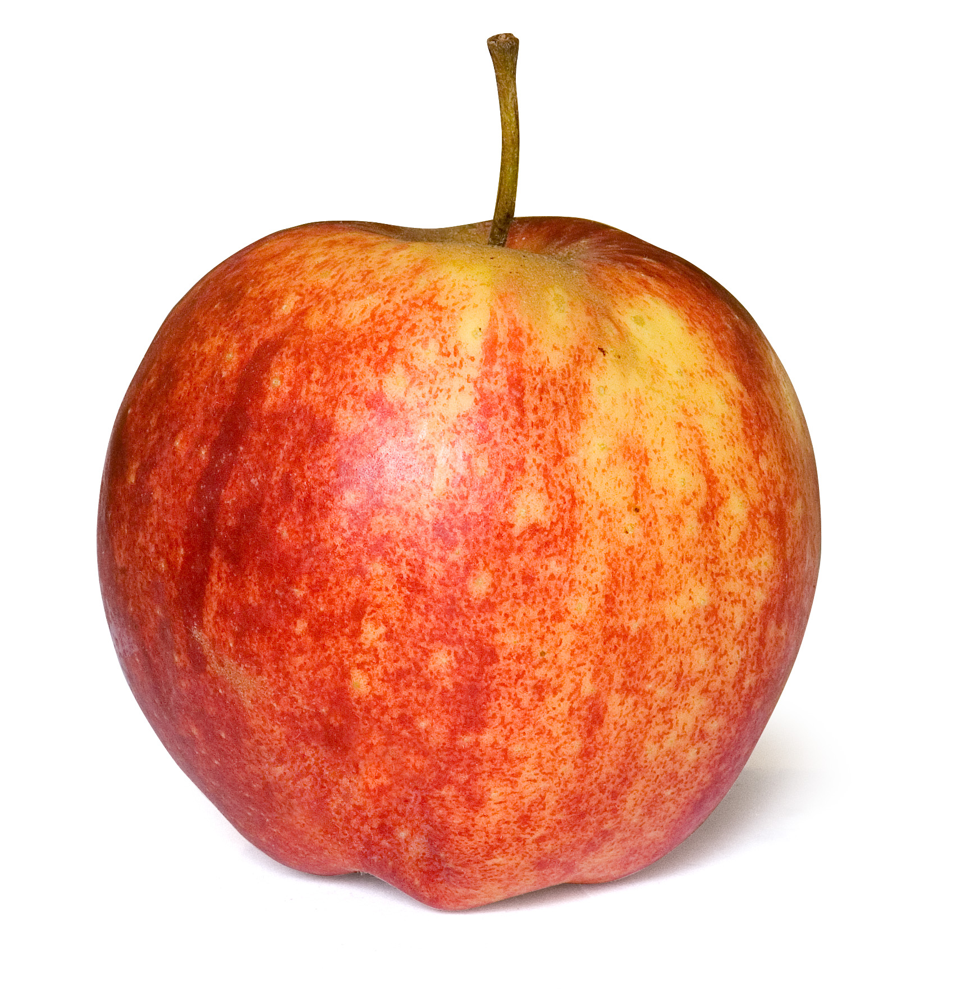
  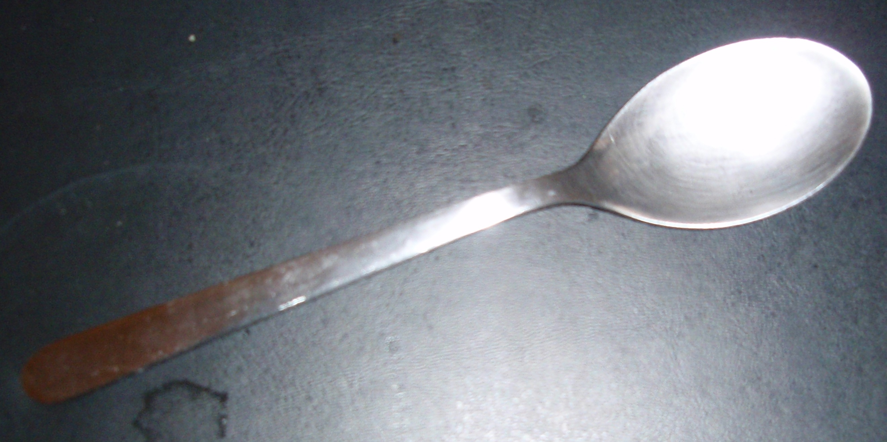
  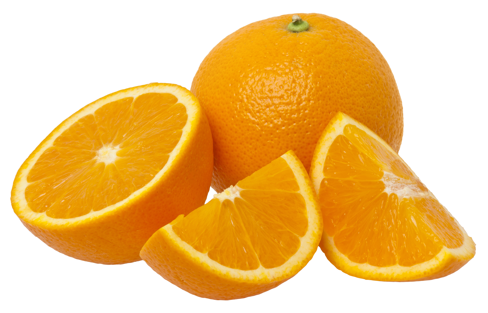
  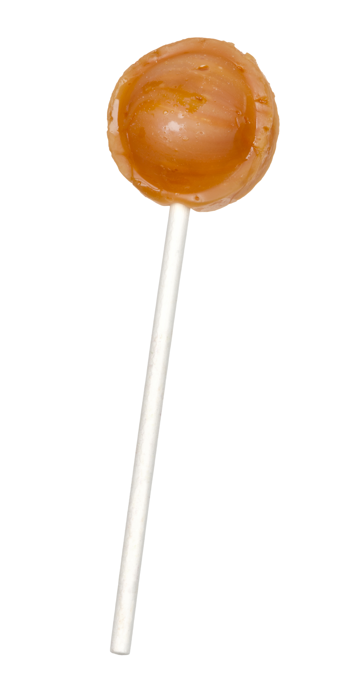
</div>
```

## Try it: name the pictures {#naming-start data-autoslide=0}

**Say the first name that comes to mind, out loud.**

- Look at the **+** before each picture.
- Begin speaking before the picture disappears: **600 ms**.
- Keep going if you make a mistake. There are **eight pictures**.

```{=html}
<button class="naming-button" type="button" data-naming-start disabled>Start naming</button>
<p id="naming-status" class="naming-status" role="status">Loading pictures...</p>
<noscript>This timed demonstration needs JavaScript.</noscript>
```

::: {.notes}
This classroom demonstration uses the 600 ms picture exposure from practice,
without the beep. Each trial has a 750 ms fixation, a 600 ms picture, and a
1000 ms blank. The study's experimental trials instead kept the picture
visible for 2000 ms and used a 600 ms response-onset goal.

Click Start naming when everyone is ready. The slides advance automatically
and stop at the discussion. Esc stops the sequence and returns here; the
button starts again from the first picture. Switching tabs also stops it.

These are independently selected internet photographs, not the study's
stimuli or a controlled stimulus set. No speech or response times are
recorded. Browser and projector refresh can affect the actual exposure;
this is a demonstration of time pressure, not a timing instrument.
:::

## Fixation 1 {#naming-fixation-1 .naming-trial data-autoslide=750}

::: {.naming-stage .naming-fixation}
\+
:::

## Picture 1 {#naming-picture-1 .naming-trial data-autoslide=600}

::: {.naming-stage}
{fig-alt="Banana" loading="eager"}
:::

## Blank 1 {#naming-blank-1 .naming-trial data-autoslide=1000}

::: {.naming-stage}
&nbsp;
:::

## Fixation 2 {#naming-fixation-2 .naming-trial data-autoslide=750}

::: {.naming-stage .naming-fixation}
\+
:::

## Picture 2 {#naming-picture-2 .naming-trial data-autoslide=600}

::: {.naming-stage}
{fig-alt="Hammer" loading="eager"}
:::

## Blank 2 {#naming-blank-2 .naming-trial data-autoslide=1000}

::: {.naming-stage}
&nbsp;
:::

## Fixation 3 {#naming-fixation-3 .naming-trial data-autoslide=750}

::: {.naming-stage .naming-fixation}
\+
:::

## Picture 3 {#naming-picture-3 .naming-trial data-autoslide=600}

::: {.naming-stage}
{fig-alt="Pear" loading="eager"}
:::

## Blank 3 {#naming-blank-3 .naming-trial data-autoslide=1000}

::: {.naming-stage}
&nbsp;
:::

## Fixation 4 {#naming-fixation-4 .naming-trial data-autoslide=750}

::: {.naming-stage .naming-fixation}
\+
:::

## Picture 4 {#naming-picture-4 .naming-trial data-autoslide=600}

::: {.naming-stage}
{fig-alt="Scissors" loading="eager"}
:::

## Blank 4 {#naming-blank-4 .naming-trial data-autoslide=1000}

::: {.naming-stage}
&nbsp;
:::

## Fixation 5 {#naming-fixation-5 .naming-trial data-autoslide=750}

::: {.naming-stage .naming-fixation}
\+
:::

## Picture 5 {#naming-picture-5 .naming-trial data-autoslide=600}

::: {.naming-stage}
{fig-alt="Apple" loading="eager"}
:::

## Blank 5 {#naming-blank-5 .naming-trial data-autoslide=1000}

::: {.naming-stage}
&nbsp;
:::

## Fixation 6 {#naming-fixation-6 .naming-trial data-autoslide=750}

::: {.naming-stage .naming-fixation}
\+
:::

## Picture 6 {#naming-picture-6 .naming-trial data-autoslide=600}

::: {.naming-stage}
{fig-alt="Spoon" loading="eager"}
:::

## Blank 6 {#naming-blank-6 .naming-trial data-autoslide=1000}

::: {.naming-stage}
&nbsp;
:::

## Fixation 7 {#naming-fixation-7 .naming-trial data-autoslide=750}

::: {.naming-stage .naming-fixation}
\+
:::

## Picture 7 {#naming-picture-7 .naming-trial data-autoslide=600}

::: {.naming-stage}
{fig-alt="Orange" loading="eager"}
:::

## Blank 7 {#naming-blank-7 .naming-trial data-autoslide=1000}

::: {.naming-stage}
&nbsp;
:::

## Fixation 8 {#naming-fixation-8 .naming-trial data-autoslide=750}

::: {.naming-stage .naming-fixation}
\+
:::

## Picture 8 {#naming-picture-8 .naming-trial data-autoslide=600}

::: {.naming-stage}
{fig-alt="Lollipop" loading="eager"}
:::

## Blank 8 {#naming-blank-8 .naming-trial data-autoslide=1000}

::: {.naming-stage}
&nbsp;
:::

## What happened under time pressure? {#naming-finished data-autoslide=0}

```{=html}
<button class="naming-button" type="button" data-naming-start disabled>Replay the eight pictures</button>
```

::: {.notes}
Expected names, in order: banana, hammer, pear, scissors, apple, spoon,
orange, lollipop. Accept ordinary alternatives where appropriate, such as
sucker for lollipop. A different acceptable name is not necessarily a
retrieval error. Ask for the actual response and intended name before
classifying a substitution. Replaying makes the items familiar, so it is
not an independent repeat under the same conditions.

Image sources and licenses are on the final slide.
:::


## Picture exposure and response deadline {#trial-timing}

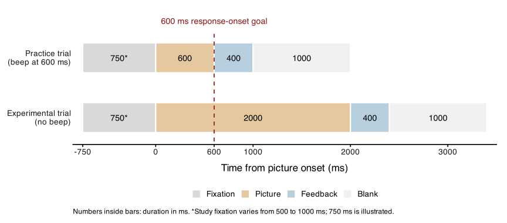{.nostretch .scientific-plot height=440 fig-alt="Trial timelines: practice uses a 600 ms picture and 400 ms feedback; experimental trials use a 2000 ms picture and 400 ms feedback. Both have a 600 ms response goal and 1000 ms blank."}

::: footer
Diagram from Lampe et al. 2024, p. 24
:::

::: {.notes}
X is time from picture onset; the two rows show practice and experimental trials, and bar widths show each stage's duration.
Left of zero is before the picture appears, right is after, and the red line marks the 600 ms goal for starting speech.
:::

## Can we know the answer from this experiment?


::: {.notes}
Pause here before moving to the results. Ask students to give the direction
of each comparison, not just name a variable. The predictions are higher
typicality, more features, and higher similarity than the near-neighbour
average. Ask why pelican and peacock cannot be ranked confidently just by
looking at the words: we need the feature norms and the relevant comparisons.

The design can detect systematic biases among observed errors. It cannot
guarantee the response on an individual trial or establish a causal effect
of typicality, richness, or similarity independently of all other properties.
Statistical controls help, but those semantic properties were not randomly
assigned. Nor can these results alone decide whether lexical selection is
competitive. Return to those limits after revealing the results.
:::

## Results: Table 1 {#lampe-table1 .error-table}

| Broad category | Error type | Count | % of errors |
|---|---|---:|---:|
| Semantic errors | Coordinate | 1,677 | 85.30 |
| | Semantic other | 92 | 4.68 |
| | Part-whole relationship | 23 | 1.17 |
| | Associate | 8 | 0.41 |
| | Superordinate | 3 | 0.15 |
| Other errors | Unrelated | 111 | 5.65 |
| | Visual | 29 | 1.48 |
| | Phonologically related word | 22 | 1.12 |
| | Compound | 1 | 0.05 |
| | **Total** | **1,966** | **100.00** |

::: footer
Lampe et al. 2024, Table 1, p. 28; errors included in the primary analyses
:::

::: {.notes}
Read each example as target → response. These are the paper's coding
examples (p. 25), not necessarily observations retained in Table 1.

- **Coordinate:** swan → duck. Both belong to the same category.
- **Semantic other:** turkey → beetle. Both are animals, but belong to different categories in the study.
- **Part-whole relationship:** wall → brick. The response names a part of the target.
- **Associate:** blender → smoothie. The response is something made using the target.
- **Superordinate:** apple → fruit. The response names the target's broader category.
- **Unrelated:** guitar → animal. The words have no semantic or sound relationship.
- **Visual:** bullet → lipstick. The objects look similar but are unrelated in meaning.
- **Phonologically related word:** medal → pedal. The words share sounds but are unrelated in meaning.
- **Compound:** strawberry → straw. The response gives only part of the compound target.

Percentages use the 1,966 analysed errors as the denominator, not all
naming trials. Most analysed errors were coordinate substitutions.
:::

## What did they find? {.smaller}

**1,966 errors** in the primary analysis; **85.3%** were same-category substitutions.

| Prediction | Result |
|---|---|
| More typical than the target | **Supported:** adjusted difference +2.52, p < .01 |
| More semantic features than the target | **Supported:** +0.61 features, p < .05 |
| Closer than the near-neighbour average | **Not supported:** similarity difference −0.06, p < .001 |

Errors were often near neighbours, but **not systematically closer than the average near neighbour**.

<!-- ::: {.claim}
Meaning matters beyond similarity alone. These patterns do not decide whether lexical selection is competitive.
::: -->

::: footer
Lampe et al. 2024, pp. 28 to 30, 33 to 35; Tables 1 and 2
:::

::: {.notes}
The reported numbers are adjusted model intercepts, in the original units
of each measure; they are not standardized effect sizes. The authors
describe the effects as small. The 95% confidence intervals are 0.81 to
4.22 for typicality, 0.13 to 1.09 for feature count, and −0.09 to −0.03
for similarity.

Of 23,166 responses, 5,089 were incorrect, including nonword responses.
After restricting to available norms and excluding poorly named items,
2,349 real-word errors remained. The primary analysis used the 1,966 with
the required similarity measure; some targets had no near neighbours in
the database. Do not describe 1,966 as the total number of errors made.

For same-category (coordinate) errors alone, similarity did not differ
significantly from the near-neighbour average. Unrelated and distantly
related responses contributed to the negative similarity difference in
the full analysis. Typicality was not significant in the smaller
coordinate-only analysis controlling for similarity (p = .065), but was
significant in the larger coordinate analysis without that control.
The feature-count result was consistent across analyses.

Mean target-error cosine similarity was .44 overall and .50 for coordinate
errors, compared with the > .4 definition of a near neighbour. This is
consistent with Mirman's near-neighbour finding, while failing to support
the stronger prediction of above-average closeness within that neighbourhood.

The authors suggest that more typical or feature-rich alternatives can
receive stronger semantic activation. This is a proposed explanation, not
activation directly measured in the experiment. Both competitive and
noncompetitive accounts can accommodate the patterns with appropriate
processing assumptions.

Full reading: Lampe, L. F., Zarifyan, M., Hameau, S., & Nickels, L. (2024).
Why is a flamingo named as pelican and asparagus as celery? Understanding
the relationship between targets and errors in a speeded picture naming
task. Cognitive Neuropsychology, 41(1-2), 18-50.
[Article](https://doi.org/10.1080/02643294.2024.2315822).
:::


## The distributions: typicality and features {#lampe-distributions}

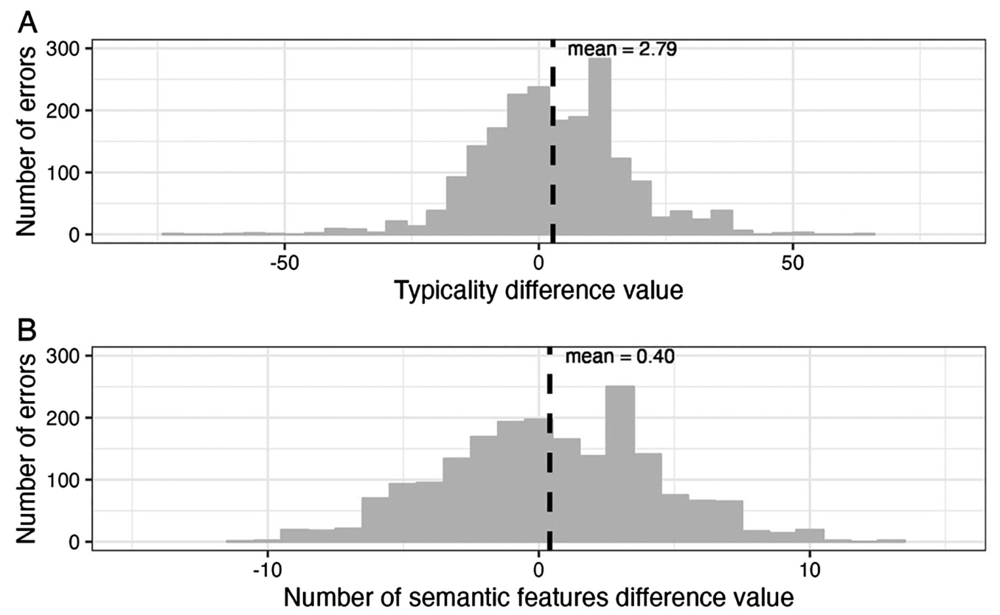{.nostretch .scientific-plot height=440 fig-alt="Lampe Figure 1 panels A and B: histograms of error minus target typicality and feature count. Raw mean differences are 2.79 and 0.40, with wide variation on both sides of zero."}

::: footer
[Lampe et al. 2024, Figure 1A and 1B, p. 29](https://doi.org/10.1080/02643294.2024.2315822), original panels
:::

::: {.notes}
X is error minus target typicality (A) or feature count (B); Y counts errors in each range.
Left of zero means less typical or fewer features, right means more, and the dashed line is the raw mean.
:::

## Similarity: what is the comparison? {#lampe-similarity}

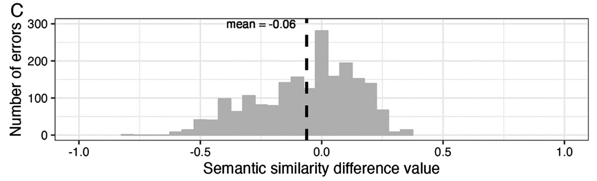{width=90% fig-alt="Lampe Figure 1C: histogram of target-error similarity minus the target's average near-neighbour similarity. The raw mean difference is minus 0.06."}

**Zero:** the error is as similar to the target as the average near neighbour is.

**Below zero:** the error is less similar than that average.

::: footer
[Lampe et al. 2024, Figure 1C, p. 29](https://doi.org/10.1080/02643294.2024.2315822), original panel
:::

::: {.notes}
X is target-error similarity minus the target's average near-neighbour similarity; Y counts errors in each range.
Left of zero means less similar than that average, right means more similar, and the dashed line is the raw mean.
:::
<!--
## The adjusted estimates {#lampe-estimates}

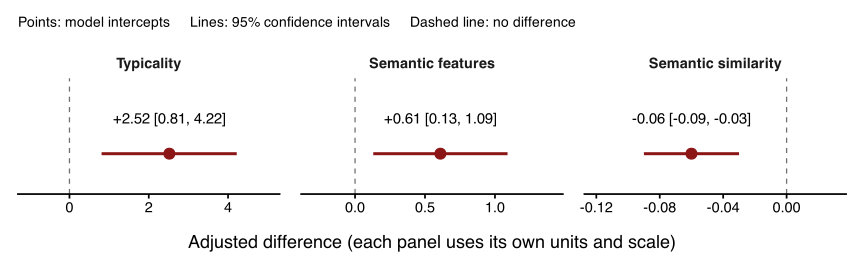{width=100% fig-alt="Primary-analysis intercepts and 95 percent confidence intervals: typicality 2.52, 0.81 to 4.22; feature count 0.61, 0.13 to 1.09; similarity minus 0.06, minus 0.09 to minus 0.03."}

- **Typicality and features:** error minus target.
- **Similarity:** target-error similarity minus the target's near-neighbour average.

::: footer
Plotted from Lampe et al. 2024, p. 28; primary analyses, 1,966 errors
:::

::: {.notes}
X shows model-adjusted differences using the histogram subtractions; vertical position has no meaning, dots are estimates, and lines are 95% confidence intervals.
Left of zero means lower typicality, fewer features, or less similarity; right means the reverse, with a different scale in each panel.
::: -->

## Naming demo: image credits {.naming-credits data-autoslide=0}

Photographs from Wikimedia Commons, saved locally. Originals or Commons thumbnails; no content edits.

| Picture and source | Creator | License |
|---|---|---|
| [Banana](https://commons.wikimedia.org/wiki/File:Banana_on_white_background.jpg) | Paolo Neo | Public domain |
| [Hammer](https://commons.wikimedia.org/wiki/File:Claw-hammer.jpg) | Evan-Amos | Public domain |
| [Pear](https://commons.wikimedia.org/wiki/File:Pear-2.jpg) | MartinThoma | [CC0 1.0](https://creativecommons.org/publicdomain/zero/1.0/) |
| [Scissors](https://commons.wikimedia.org/wiki/File:Pair_of_scissors_on_white_background.jpg) | Help e choose | [CC BY-SA 4.0](https://creativecommons.org/licenses/by-sa/4.0/) |
| [Apple](https://commons.wikimedia.org/wiki/File:Apple-003.jpg) | Amada44 | Public domain |
| [Spoon](https://commons.wikimedia.org/wiki/File:Spoon.JPG) | Ari Abitbol | Public domain |
| [Orange](https://commons.wikimedia.org/wiki/File:Orange-Fruit-Pieces.jpg) | Evan-Amos | [CC BY-SA 3.0](https://creativecommons.org/licenses/by-sa/3.0/) |
| [Lollipop](https://commons.wikimedia.org/wiki/File:Tootsie-Roll-Pop-Orange.jpg) | Evan-Amos | Public domain |

## Appendix: how are the measures calculated? {.smaller}

Start with features people listed for each word, such as **has wings** or **flies** (McRae et al., 2005).

- **Typicality:** for each feature, multiply the proportion of category members sharing it by the number of people who listed it for that word, then add the scores. Shared, often-mentioned features give higher typicality.
- **Number of features:** count the different listed properties, excluding category labels such as *is a bird*.
- **Semantic similarity:** compare two words' feature profiles using **cosine similarity**. More overlap gives a higher score.

::: footer
Lampe et al. 2024, p. 23; measures based on McRae et al. 2005
:::

::: {.notes}
Toy typicality example: if 8 of 10 birds share a feature and 5 people listed
it for this bird, that feature contributes (8 / 10) × 5 = 4; add the
contributions of all its features.

For typicality and feature count, the analysis uses error minus target.
For similarity, it uses target-error cosine similarity minus the target's
average similarity to its near neighbours (those with cosine > .4).
:::
