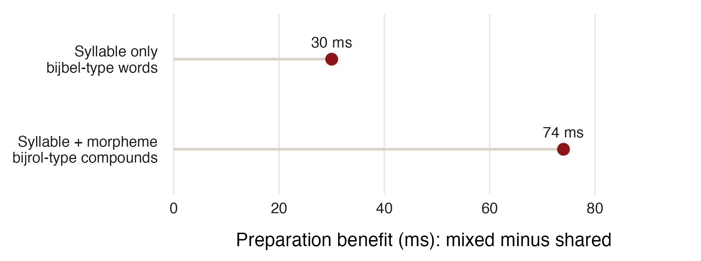

## The conditions: cue, response, shared part {.smaller}

Each row is a **three-pair block**. Learn cue → response; then see only the cue
and say its response.

| Cue | Response | Condition name | Shared |
|---|---|---|---|
| **religie** haast spoor | **bijbel** bijna bijster | Syllable: shared | Initial syllable **bij** |
| **religie** brein dicht | **bijbel** hersens nader | Syllable: mixed | No common beginning |
| studie **toneel** long | bijvak **bijrol** bijnier | Morpheme: shared | Initial morpheme **bij** |
| **toneel** steiger mond | **bijrol** herbouw nasmaak | Morpheme: mixed | No common beginning |

**religie → bijbel:** religion → bible  
**toneel → bijrol:** stage → supporting role

::: footer
Actual materials: Roelofs 1996, Experiment 1, Table 1, p. 862; example blocks
:::

::: {.notes}
Read across each line within a table cell. Religie is paired with bijbel,
haast with bijna, and spoor with bijster. These three pairs form one shared
syllable block: every possible response begins with bij. The next row gives
a mixed block: religie still cues bijbel, but the other responses now begin
with different syllables. Pairings do not change; grouping changes.

Do the same for the compound conditions. Toneel cues bijrol in both the
shared-morpheme block and the mixed block. In the shared block all three
responses begin with the morpheme bij. In the mixed block the responses
bijrol, herbouw, and nasmaak have different beginnings. These are actual
blocks from Table 1, not invented examples or the complete stimulus list.

Bijbel and bijrol are never paired with each other here. Bijbel means bible
and is one morpheme. Bijrol means supporting role: bij contributes roughly
secondary, and rol means role. The cue for bijbel is religie, religion; the
cue for bijrol is toneel, stage.

Compare shared versus mixed within each word type. Then compare the size of
those two benefits. The experiment measured time from cue onset to speech
onset. It did not simply compare the absolute speaking times of bijbel and
bijrol. Roelofs 2000 reviews this experiment; the full cue-response materials
are provided in Roelofs 1996, Table 1.
:::

## Read the result

{width=90% fig-alt="Observed preparation benefits: 30 ms for initial syllable overlap in bijbel-type words and 74 ms for initial morpheme overlap in bijrol-type compounds."}

**Higher = more time saved.** Both groups benefit; the compound group benefits more.

::: {.prompt}
Both groups share the sounds *bij*. What could explain the extra benefit?
:::

::: footer
Roelofs 1996, Experiment 1, Table 2, p. 863; reviewed in Roelofs 2000, pp. 98 to 99
:::

::: {.notes}
Read the horizontal axis first: the preparation benefit is response time in
mixed groups minus response time in shared groups. Positive values mean
facilitation, or faster responses. The chapter's figure uses the opposite sign; this redraw makes a larger
saving positive. Values come from the original experiment's Table 2:
simple words, 648 ms mixed minus 618 ms shared = 30 ms; compounds,
699 ms mixed minus 625 ms shared = 74 ms. These are condition means across
items, not measurements of bijbel and bijrol alone. Only observed benefits
are shown here so we can discuss the findings before introducing the models. No
error bars are reconstructed from the reported condition means.

Ask students to identify which condition saves more time and then interpret
the difference. The benefit is greater when the shared syllable is also a
morpheme. This supports access to morphological constituents during planning.
It is not evidence that compounds are always faster to produce than simple words.
:::

## What must a model explain?

- **Units:** preparing a morpheme saves more time than preparing its sounds alone.
- **Order:** in further experiments, a shared later morpheme, such as **rol**
  in *bijrol*, gave **no preparation benefit**.

::: {.prompt}
What can be completed before the cue, and why must preparation start at the beginning?
:::

::: footer
Roelofs 2000, pp. 98 to 99
:::

::: {.notes}
These are two constraints on a model: what the system prepares and in what
order. A model needs to explain the time saved, not simply say that related
words activate one another. Take the published effects as the observations
we want to explain before introducing either architecture.

If useful, mention that semantically opaque compounds such as bijval,
applause, also showed an extra morphological benefit. Constituent access
alone does not rule out storing whole forms as well.
:::

## WEAVER++: select, then encode

**Concept → lemma + features → morphemes → sounds → speech**

- A **lemma** supplies grammatical information; normally, only the selected
  lemma starts form encoding.
- **Verification** checks that a candidate belongs to the selected word.
  Activation affects how long selection takes.
- **Rightward incrementality:** build the sound plan from the beginning,
  pause, then resume when more is known.

**For *bijrol*:** prepare the morpheme *bij* and its syllable.  
**For *bijbel*:** prepare the syllable only.

::: footer
Roelofs 2000, pp. 83 to 87, 93 to 98; simplified production sequence
:::

::: {.notes}
For bijbel, the whole morpheme must wait until the cue identifies the word.
For bijrol, the initial morpheme can already be selected. That saves an
additional step after the cue. A known later morpheme cannot supply the
beginning of the sound plan.

A lemma is not the pronunciation. Its features help determine which forms
are retrieved. Form encoding retrieves morphemes and their segments,
syllabifies the segments in context, and accesses syllable motor programs.
Output sounds do not feed activation back into lemma selection.

For Sasha's seriality question, distinguish two claims. Selection precedes
form encoding for a given word; within sound planning, the encoder proceeds
from the beginning. Neither means that only one node can be active at a time
or that an entire sentence must be planned before speech begins. Activation
can spread to multiple candidates, and different encoding processes can
overlap on successive pieces. Rightward here means order of pronunciation,
not the writing direction of a language. The Dutch evidence does not settle
how every language plans its words.
:::

## Dell: activation with feedback

**Conceptual features ↔ lemmas ↔ morphemes ↔ sounds**

- Activation spreads down **and back up**; shared sounds can support a word.
- At scheduled selection times, the most active eligible unit fills a slot.
- This helps explain **mixed errors**: *rat* for *cat* shares meaning and sounds.

::: footer
Roelofs 2000, pp. 76 to 81; classical Dell model, simplified
:::

::: {.notes}
Both models include morphemes. The key difference is how activation leads
to selection. In classical Dell, feedback gives rat support from both its
semantic relationship to cat and its shared sounds. This helps explain why
mixed errors are overrepresented relative to opportunities for those errors.

Selection intervals depend on speech rate. At a given rate, priming can
change which unit wins without changing when selection happens. This is
Roelofs's criticism of the classical timing mechanism. Do not generalize it
to every later model in the Dell tradition.
:::

## Same units, different selection mechanisms

| | Classical Dell | WEAVER++ |
|---|---|---|
| Sounds feed back to word selection? | Yes | No |
| Selection | Most active eligible unit at a scheduled time | Activation plus verification; time varies |
| Main evidence explained | Speech-error patterns | Production-time patterns |

::: {.prompt}
Which mechanism explains why advance preparation changes response time?
:::

::: footer
Roelofs 2000, pp. 80 to 87, 98; comparison of the versions reviewed here
:::

::: {.notes}
Connect the answer to the experiment. WEAVER++ explicitly models work that
can be done before the cue and the resulting reduction in latency. Merely
adding activation to classical Dell does not change its fixed selection
intervals at a given speech rate. Its timing assumptions would need extension.

These are the models' main explanatory targets, not exclusive abilities:
WEAVER++ also offers accounts of errors. The class demonstration alone cannot
decide between the models; the controlled Dutch comparisons motivate the
mechanisms we have just discussed.
:::

## Your Questions

::: {.notes}
**Basia: How deep do frequency effects go? Does using words together make
one activate the other, as with cat and dog?**

Frequency effects extend beyond lemmas. The chapter locates the robust
word-frequency effect at form access. Homophones can share frequency at the
form level, and morpheme-frequency effects provide another example. The
chapter also discusses small and inconsistent syllable-frequency effects;
frequency does not necessarily affect every level equally. In the simulations,
frequency changes the speed of rule application.

Separate an individual word's frequency from association between words.
Cat and dog are semantically related as well as often associated, so that
example cannot isolate co-occurrence. Testing association would require
controlling semantic similarity and each word's frequency.

**Sasha: Does activation reflect learning from previous mistakes? Could
English influence my Russian because the system is set to English?**

Activation spreading during a trial differs from learning across trials.
The chapter explains selection and timing but does not give a full account
of learning from errors. Cross-language influence is a useful observation,
but it does not by itself identify which nodes were active or establish a
single language setting for the whole production system.

**Sasha: What does inhibiting hyperonyms mean, and what is facilitation?**

Furniture is a hyperonym of chair. Bierwisch and Schreuder propose that
activating chair inhibits furniture. Roelofs challenges this because a
related word can facilitate, or speed, a response in the tasks he reviews.
Facilitation means a shorter response time relative to a comparison condition.
This inhibition proposal is not a defining assumption of WEAVER++.

**Sasha: What is seriality in WEAVER++? Is rightward incrementality universal?**

Distinguish two claims: lemma selection precedes form encoding for a given
word, and its sound plan develops from the beginning. Many candidates can
still be active at once, and processes can overlap on successive pieces.
Rightward means pronunciation order, not writing direction. The Dutch
findings do not settle planning order for every language; the chapter does
not establish a cross-linguistic inventory of alternatives.

Sources for Basia and Sasha: Roelofs 2000, pp. 85 to 90, 95 to 99, 103 to 105.

**Kendi: How would WEAVER++ explain she ... him becoming he ... her while
preserving case? Must pronoun lemmas initially be gender-neutral?**

WEAVER++ distinguishes grammatical specifications from the forms that realize
them. Case appropriate to the new position could be realized after an exchange.
The error is compatible with an exchange before form realization, but it does
not establish gender-neutral lemmas. It also does not determine whether
referents, gender features, or lemmas exchanged, nor prove that case was first
assigned only after the exchange. The chapter does not implement this exact
pronoun error.

**Ethan: If speakers can generalize a pattern, why do exceptions exist?**

A productive pattern can coexist with stored exceptional forms. A lexical
system can retain information needed to select an exception. For example,
consider what lexical and grammatical information would select went for
GO + PAST. This extends the distinction between grammatical input and form
retrieval; it is not a simulation of went supplied by the chapter. Explaining
how a speaker produces an exception now does not explain why it arose or
persisted historically. That requires evidence beyond this processing account.

**Examples to discuss: competing past-tense forms.**

- **Broadcast / broadcasted:** compare “The news was broadcast live” and
  “The news was broadcasted live.” Both forms are listed by
  [Merriam-Webster](https://www.merriam-webster.com/dictionary/broadcast).
  The regular variant illustrates the availability of the -ed pattern;
  its existence alone does not establish a rapid recent increase.
- **Pled / pleaded:** compare “He pled guilty” and “He pleaded guilty.”
  These are longstanding alternatives. Both remain standard in American
  legal usage, with pleaded more frequent, according to
  [Merriam-Webster](https://www.merriam-webster.com/dictionary/plead).
  Avoid presenting pleaded as a new form that has almost eliminated pled.
- **Dreamt / dreamed, burnt / burned, leant / leaned, leapt / leaped:**
  these show variation between competing forms. American English generally
  favors -ed more than British English, but the -t forms are not simply
  obsolete; burnt also remains common in American English. See
  [Paul Brians on -ed and -t variants](https://public.archive.wsu.edu/brians/public_html/errors/edet.html).

**Connection to frequency:** frequent exceptions may be easier to retain
because speakers repeatedly encounter and retrieve them. That is a plausible
learning interpretation, not a historical-change mechanism implemented in
WEAVER++. In a historical study, less frequent English irregular verbs tended
to regularize faster than more frequent ones
([Lieberman et al. 2007](https://www.nature.com/articles/nature06137)).
This supplies evidence relevant to why some exceptions persist even when a
productive pattern is available.

Separate the token frequency of a particular verb or form from the number
of different verbs following a pattern. The examples above illustrate
competition; they do not by themselves prove a frequency explanation for
each change. Dialect, context, and analogy also matter, and change can favor
irregular forms as well as regular ones
([Newberry et al. 2017](https://www.nature.com/articles/nature24455)).

Sources for Kendi and Ethan: discussion extending Roelofs 2000, pp. 74, 93,
on grammatical specifications and form encoding. The usage examples and
historical findings above are supplementary to the assigned reading.
:::

## Try it: prepare a grammatical form {.demo}

[Open the experiment](../implicit-priming.qmd) · Choose **Grammar**

See **GO** and “Yesterday, I ___ home.” Say only **went**.

| Condition | Example responses | Shared |
|---|---|---|
| Same grammatical context | went, ate, bought | Simple past; no common affix |
| Mixed grammatical contexts | went, eat, bought | Past, habitual present, present perfect |

::: {.notes}
The grammar session is an extension of the preparation task. Every block
contains GO, EAT, and BUY. Shared blocks have one grammatical context:
simple past, habitual present, or present perfect. Mixed blocks have all
three contexts. The same nine verb-and-sentence items return in both
conditions, including the same intended response for each item.

The example mixed block contains GO with Yesterday, I ___ home; EAT with
Every day, I ___ lunch; and BUY with I have already ___ bread. Bought
realizes both simple past and the participle; the sentence determines which
feature specification is intended. These remain distinct items in the data.

Let the experiment give timing instructions. Say only the missing verb,
not the whole sentence. If time permits, choose Prefixes afterward to
experience shared sounds and morphemes as well.
:::

## Was it easier to stay in one grammatical context?

In a shared past-tense block, you knew **past tense** before seeing the verb.
The responses *went, ate, bought* share no common affix.

::: {.prompt}
Did switching grammatical contexts make it harder to get ready?
:::

**Model question:** can we prepare grammatical information before its word form?

::: {.notes}
Use the experience to discuss the distinction between grammatical features
and the forms that realize them. A benefit in this new session is a question
to test, not an established result of the Dutch experiment or a guaranteed
prediction of WEAVER++.

Repeated sentence contexts and reduced switching can also help. This task
therefore does not isolate a model stage or distinguish WEAVER++ from Dell
by itself. Both models distinguish grammatical information from sound forms.
The paper's bijbel/bijrol contrast specifically concerned preparing form
constituents, which is different from sharing an abstract grammatical feature.

If students also run Prefixes, ask whether mixed beginnings felt harder.
Knowing un- can support advance form preparation, but the extra morphological
benefit requires the sound-only comparison supplied by the Dutch experiment.
:::
