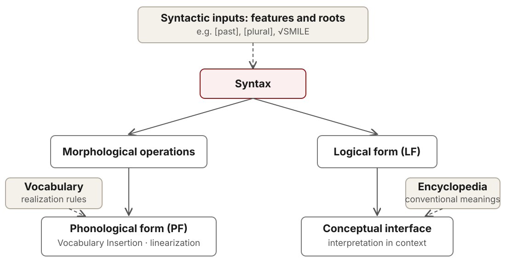

## What are we preparing when we prepare a word?

Last week: speakers can prepare **morphological pieces**, as well as sounds.

Today: what are those pieces, and how do they become a spoken word?

::: {.prompt}
Compare **smile**, **smiles**, and **smiled**. What stays the same? What changes?
:::

::: {.notes}
Allow two minutes for observations before introducing terminology. Students
may mention spelling, sounds, tense, number, or word class. Ask for a sentence:
two smiles versus she smiles makes the ambiguity of smiles useful. Do not
assume that identical written endings have identical functions.

Connect to the Roelofs discussion: preparing a compound constituent gave an
extra benefit beyond sound overlap. That motivates asking what morphological
representations contain; it does not establish DM specifically.
:::

## A first pass: meaningful pieces

| Word | A first segmentation | Contributions |
|---|---|---|
| dogs | dog-s | dog + plural |
| unkind | un-kind | negation + kind |
| workers | work-er-s | work + person who does it + plural |

A **morpheme**, in a familiar introductory definition, is a minimal pairing
of form with meaning or grammatical function.

::: {.notes}
A recurring sound is not enough to establish a morpheme: corner does not
contain corn in the relevant sense. The introductory definition pairs form
and function; DM will separate them.
:::

## Root, base, affix

**work → worker → workers**

| Term | What it identifies | Here |
|---|---|---|
| **Root** | The core left after removing affixes | work |
| **Base** | What an affix attaches to | work for -er; worker for -s |
| **Affix** | A bound piece attached to a base | -er, -s |

A base can already contain several morphemes.

::: {.notes}
[[work-er]-s]: work is the root and the base for -er; worker is the base
for -s. Some descriptions reserve stem for the base of inflection.
Later, distinguish the abstract root √WORK from the pronounced word work.
:::

## Ambiguities in words

**unlockable** can have two bracketings:

| Structure | Interpretation |
|---|---|
| [un-[lock-able]] | Not able to be locked |
| [[un-lock]-able] | Able to be unlocked |

Same linear pieces; different combinations and meanings.

::: {.notes}
Use a door that cannot be locked versus a door that can be unlocked.
The first un- forms an adjective with negative meaning; the second forms
a reversative verb. Not every speaker finds both readings equally natural
without context. These are explanatory paraphrases.

Hierarchy is not unique to DM. What distinguishes DM here is its proposal
that the word-internal hierarchy is built by syntax; see Marantz (1997).
:::

## Free/bound and lexical/functional {.smaller}

These answer **different questions**.

| | Lexical content | Grammatical function |
|---|---|---|
| **Free:** can occur as a word | dog, kind | the, and |
| **Bound:** needs a host | cran- in cranberry | plural -s, past -ed |

**Free/bound:** how dependent is its form?  
**Lexical/functional:** what kind of contribution does it make?

::: {.prompt}
Why isn't “root” another word for “free morpheme”?
:::

::: {.notes}
Free here means able to occur as a grammatical word without being an affix,
not necessarily able to form a felicitous utterance alone. Function words
such as the can be prosodically dependent. Keep the grammatical and
phonological senses of independence apart.

Cran- is the traditional bound-root example. Its contribution identifies a
kind of berry; it has no readily isolable independent meaning in current
English. That already complicates our first definition. This is a useful
diagnostic table, not a claim that all morphemes fall into uncontroversial
categories. Derivational affixes add another complication: having meaningful
content does not make an affix a lexical root in DM.
:::

## Affixes can go in different places {.smaller}

| Pattern | Position | Example |
|---|---|---|
| **Prefix** | Before a base | un-kind |
| **Suffix** | After a base | kind-ness |
| **Infix** | Inside a base | Tagalog s-um-ulat, from sulat ‘write’ |
| **Circumfix pattern** | Around a base | German ge-spiel-t ‘played’, participle |

Position describes **where the material appears**.

::: {.notes}
In Tagalog, -um- marks actor voice; do not equate it with English past -ed.
The point here is its placement after the initial consonant. An affix in the
middle of a sequence of suffixes is not thereby an infix: -er in workers is
still attached at the right edge of work.

The German form is a surface circumfix pattern. Whether ge-…-t is one
discontinuous exponent, two pieces, or partly the result of a rule is an
analysis to be argued for. Do not infer one morpheme simply from one grammatical function.
:::

## Derivation and inflection

| | Typical job | Example |
|---|---|---|
| **Derivation** | Make a new lexeme | kind → kindness; kind → unkind |
| **Inflection** | Make a grammatical form of a lexeme | dog → dogs; smile → smiled |

Derivation **can** change word class; *unkind* shows that it need not.

Inflection contributes meaning too: **past** and **plural** matter.

::: {.notes}
Define lexeme informally as a vocabulary entry abstracting over its
grammatical forms. SMILE includes smile, smiles, smiled, smiling. That is
descriptive terminology; it does not decide what DM stores.

Avoid teaching “derivation has meaning, inflection does not.” Likewise,
category change is a useful cue rather than a definition. The distinction
has borderline cases; participles can be saved for another day. Compounding,
as in doghouse, combines lexical bases and is another way to form a lexeme.
:::

## Try the distinctions

**unhappiness** · **replayed** · **doghouses**

For each word:

1. Identify roots and affixes.
2. Identify a base that contains more than one morpheme.
3. Separate derivation, inflection, and compounding.

::: {.prompt}
Which labels describe position, and which describe function?
:::

::: {.notes}
Give pairs three minutes, then take one answer per word.

Unhappiness: [[un-happy]-ness], root happy, prefix un-, suffix -ness;
unhappy is a complex base for -ness. Both affixes are derivational. The
y/i spelling difference does not introduce a new morpheme.

Replayed: [[re-play]-ed], root play, derivational prefix re-, inflectional
suffix -ed; replay is the base for -ed in a past-tense sentence.

Doghouses: [[dog-house]-s], two roots forming a compound base, followed by
plural inflection. House is not an affix merely because it comes second.
For all three, identify free root forms and bound affixes. Stress that a
single item can be both a suffix (position) and inflectional (function).
:::

## One function, several pronunciations

| Plural form | Ending we hear |
|---|---|
| cats | [s] |
| dogs | [z] |
| buses | [ɪz] or [əz] |

These are **allomorphs**: different realizations of a morpheme.

Here, the surrounding **sounds** predict the variation.

::: {.notes}
Say the forms aloud. The vowel varies by accent; nothing depends on choosing
one transcription. A common analysis starts with /z/: devoice after a
voiceless nonsibilant; insert a vowel after a sibilant. Thus three surface
forms need not mean three separately stored plural Vocabulary Items.

Broad descriptive use of allomorph includes these phonological variants.
Some DM work reserves allomorphy for selection among distinct exponents.
:::

## Grammatical pieces needn't be sound segments

| Contrast | What changes in the form? |
|---|---|
| cat → cats | Add an ending |
| sheep → sheep | No audible change |
| mouse → mice | Change the stem vowel |
| go → went | Use a radically different stem: **suppletion** |

::: {.claim}
We can identify a grammatical contrast without finding a separate sound
segment for it.
:::

::: {.notes}
Use two sheep so the plural interpretation is clear. Zero exponence is an
analysis of how an independently motivated grammatical feature is realized;
we do not infer arbitrary silent morphemes wherever we like.

Mouse/mice is lexically restricted: house/houses does not follow it.
Go/went illustrates suppletion rather than a productive sound rule. These
observations motivate separating grammatical structure from realization.
They do not uniquely prove DM. Detailed analyses of stem alternations and
suppletion differ within DM; do not force all of them into affix replacement.
:::

## One ending can express several features

**She walk-s.**

The ending occurs with a bundle of properties:

**present tense + third person + singular**

Compare **I walk**, **they walk**, **she walked**.

::: {.prompt}
Where are the three separate sound pieces for those three properties?
:::

::: {.notes}
There are no three independently segmentable pieces here. This is cumulative
exponence: a single exponent can realize multiple features. It is also a
useful contrast with plural -s on nouns: shared sound does not guarantee
shared grammatical function.

This surface observation does not decide whether tense and agreement begin
as one syntactic node or are combined after syntax. That is an additional
architectural question. We return to it only briefly today.
:::

## What should a theory explain?

- **Combination:** how do the pieces form a structure?
- **Realization:** how does that structure receive a pronunciation?
- **Interpretation:** how does it receive a meaning?

::: {.claim}
DM separates these jobs and locates them in different parts of the grammar.
:::

::: {.notes}
Transition at about minute 30. Revisit the puzzles: workers requires
combination; sheep and mice require a theory of realization; unkindness and
lexically specific meanings require interpretation. The distinctions are
questions any theory should answer. DM supplies one particular architecture.
:::

## Where are words built?

| A lexicalist architecture | Distributed Morphology |
|---|---|
| A word-building component supplies words to syntax. | Syntax builds structures within words as well as phrases. |
| Word formation and phrase formation have distinct machinery. | One syntactic system combines the abstract building blocks. |

**DM:** pronunciation is supplied after syntactic combination.

::: {.notes}
Lexicalist theories allow productive word formation; lexicalism does not
require memorizing every inflected word. The contrast concerns where word
structure is built.

Late insertion separates syntactic combination from phonological
realization. Here, root pronunciations are also inserted late. The
representation of roots differs across versions of DM.

Halle & Marantz (1993), §2; Marantz (1997); Harley & Noyer (1999), §1.
:::

## “Morpheme” now means something more abstract

| First-pass definition | In the DM analysis |
|---|---|
| A minimal form–function pairing | A terminal node with grammatical content, or a root |
| Plural looks like a piece **-s** | Syntax contains **Number[plural]** |
| Its sound and function come together | A realization rule supplies its **exponent** |

**Exponent** = the form that realizes a grammatical unit.

::: {.notes}
Define terminal node as a smallest building block at the leaves of a tree.
For functional morphemes, its content is a feature or feature bundle. Roots
are distinguished from functional feature bundles. See Harley & Noyer
(1999), §1.2, for the distinction between morphemes and Vocabulary Items.

Plural is not itself the sound /z/. It can remain present when its exponent
is zero, as in a simple analysis of sheep. Conversely, a single exponent can
realize a feature bundle. This terminology is the conceptual hinge of the
class, so pause to ask a student to explain feature versus exponent.
:::

## A map of the grammar

{width=94% height=470px fig-alt="Syntactic features and roots feed syntax. Syntax branches toward morphological operations and phonological form on the left, and logical form and the conceptual interface on the right. Vocabulary Items feed phonological form; the Encyclopedia feeds the conceptual interface."}

::: {.notes}
Solid arrows trace representations; dashed arrows indicate access to
stored information. PF is phonological form; LF is the representation
used for compositional interpretation.

The meaning branch does not wait for a pronounced word to be looked up.
The branching describes grammatical dependencies, not measured processing
times. The relative order of linearization and Vocabulary Insertion is
debated.

Adapted from Harley & Noyer (1999), §1, diagram (1), with contemporary root
notation. The postsyntactic morphology component and the separation of
terminals from their exponents go back to Halle & Marantz (1993), §2.
:::

## What is distributed? {.smaller}

| Store | Stored information | Used for |
|---|---|---|
| **Syntactic inputs** | Features and roots, e.g. [past], √SMILE | Building structure |
| **Vocabulary** | Rules linking roots/features to exponents | Pronunciation |
| **Encyclopedia** | Conventional meanings and world knowledge | Interpretation in context |

There is stored knowledge, spread across these lists.

::: {.notes}
“No lexicon” means no single store that simultaneously supplies fully
specified words, builds them, and contains their sound and special meaning.
It does not mean no memory or no learned word knowledge.

The division of labor is central to early DM: see Marantz (1997) and
Harley & Noyer (1999), §§1–1.4. Bobaljik (2017), introduction, provides a
later overview. Focus on the jobs rather than memorizing list numbers.
:::

## A variation in the reading

The usual three-store presentation groups **features and roots** together.

**Goryczka (2025)** separates them into two input lists, giving four lists
in total.

The central distinction remains:

**syntactic inputs** · **pronunciations** · **conventional meanings**

::: {.notes}
Goryczka (2025), diagram (36), pp. 92–94: roots and grammatical features
occupy separate input lists, but their exponents belong to one Vocabulary.
This gives four lists instead of three.

Root–inflection dissociations in aphasia motivate this distinction, though
they do not uniquely establish four separate cognitive stores.
:::

## Build a word: *smiled*

**1. Select abstract ingredients**

**√SMILE** + **v** + **T[past]**

**2. Combine them hierarchically**

\[
\bigl[\mathrm{T}_{\text{past}}\;\bigl[\mathrm{v}\;\sqrt{\mathrm{SMILE}}\bigr]\bigr]
\]

**v** makes a verbal structure; **T** contributes tense.

::: {.notes}
√SMILE identifies the root; it is not the spoken word smile. Small v is a
verbal categorizer, and T contributes tense.

Read the brackets from inside outward: root plus v, then past tense. This
is the relevant clause fragment. Subject, arguments, agreement, and the
assembly of T with the verb are omitted. Bracket order is not pronunciation
order. Compare a smile with to smile.
:::

## Give the structure a pronunciation

**3. Vocabulary Insertion supplies exponents**

| Abstract item | Exponent in this example |
|---|---|
| √SMILE | /smaɪl/ |
| v | ∅ |
| T[past] | /d/ |

**4. Arrange the pieces and apply phonology:** [smaɪld], *smiled*.

::: {.notes}
∅ means no audible exponent. The analysis assumes a silent v. Vocabulary
Items pair phonological forms with insertion conditions.

The structure must also be assembled and linearized to give the suffix
order. English head movement and lowering are beyond today's discussion.
Past /d/ has predictable surface variants, just as plural /z/ does.

The smile/past example appears in Goryczka (2025), diagram (36). For the
realization mechanism, see Halle & Marantz (1993) and Harley & Noyer
(1999), §§1.2, 2.
:::

## Meanwhile, the structure is interpreted

**LF:** combine the structural contributions, including past tense.

**Conceptual interface:** use conventional meaning and world knowledge.

For *smiled*: a smiling event located in the past.

::: {.claim}
The root label, its pronunciation, and its interpretation have different
jobs in the analysis.
:::

::: {.notes}
This is an informal interpretation, not a full event-semantic derivation.
The Encyclopedia supplies context-sensitive conventional information; it
is not a second set of instructions for inserting sounds. A root label does
not encode all uses and associations of the word. The precise status of roots as concepts versus pointers is debated. For
the Encyclopedia and contextual interpretation, see Marantz (1997) and
Harley & Noyer (1999), §1.4.
:::

## How does the grammar choose an exponent?

A simplified plural Vocabulary:

| Realization rule | Condition |
|---|---|
| Number[plural] ↔ ∅ | In the local context of √SHEEP |
| Number[plural] ↔ /z/ | Elsewhere |

**two sheep:** the specific rule applies.  
**two dogs:** use the elsewhere rule.

::: {.notes}
The specific sheep rule blocks the general plural rule. The root also
receives its own pronunciation. Root–Number locality is abbreviated here;
the nominal categorizer and the precise locality conditions are omitted.

Once /z/ is selected for a regular plural, phonology yields [s] in cats
and a vowel-containing ending in buses. Distinguish Vocabulary selection
from these predictable sound changes.

Halle & Marantz (1993); Harley & Noyer (1999), §§1.2, 2.1;
Bobaljik (2017), §1.1.
:::

## Underspecification: a rule can say less {.smaller}

**I smiled. She smiled. They smiled.**

The subjects differ in person and number; the past ending stays **/d/**.

A rule **T[past] ↔ /d/** need not specify person or number.

- Its requirements must be present in the node.
- It must not require a conflicting feature.
- A more specific eligible competitor can block it.

**The rule can be underspecified even when the structure is fully specified.**

::: {.notes}
For underspecification and matching, see Harley & Noyer (1999), §2.1,
and Bobaljik (2017), §1.1. Connect this to the /d/ entry in the smiled
derivation: the rule says past, without a person or number restriction.
For a schematic node with [past, third person, singular], an item requiring
only [past] meets a subset of its features. The same item can fit
[past, first person, singular] or [past, third person, plural].

Bundling tense and agreement into one realization node is a teaching
assumption here. The surface pattern alone does not decide how those
features are packaged. Some accounts use a still less specified default.
Do not infer that syntax lacks person and number merely because the
exponent fails to distinguish them. Unlike impoverishment, underspecification
of a Vocabulary Item does not itself delete features from the node.
:::

## Why leave room for morphological operations?

Syntax and pronunciation may package features differently.

- **Fusion:** combine terminal nodes for realization.
- **Fission:** split a node or its realization across more than one piece.
- **Impoverishment:** remove a feature on the pronunciation branch.

These operations occur **after syntax**, toward PF.

::: {.notes}
Two-minute overview of the morphology box in the diagram.

Fusion can combine distinct syntactic nodes for realization. Several
features in one ending do not by themselves establish fusion: the features
might already occupy one node. Implementations of fission differ.

Impoverishment removes a feature on the PF branch while leaving the
interpretive distinction available on the other branch.

Halle & Marantz (1993), §2; Harley & Noyer (1999), §3;
Bobaljik (2017), §3. Return to spanning with Nanosyntax.
:::

## Your turn: *record*

Keep a **record** of the meeting.

Please **record** the meeting.

::: {.prompt}
How would DM derive these two uses of *record*, using its different lists?
:::

::: {.notes}
Two minutes. Read both sentences aloud before taking analyses.

Structures: [n √RECORD] and [v √RECORD]. The noun has initial stress;
the verb has final stress. Common American pronunciations are /ˈrɛkɚd/
and /rɪˈkɔɹd/, with a vowel-quality difference as well.

Syntactic inputs: a shared root plus n or v. Vocabulary/PF: realization
must refer to the categorial context. Possible accounts use conditioned
root exponents or category-sensitive stress and vowel reduction. The data
do not decide between these mechanisms. The category heads have no
separate segmental exponent in these structures.

Interpretation: a preserved account versus the activity of preserving
information. The Encyclopedia contributes conventional root-related
knowledge; the structure contributes to the difference in interpretation.

Pronunciations: [Oxford](https://www.oxfordlearnersdictionaries.com/definition/english/record_1)
and [BBC Learning English](https://downloads.bbc.co.uk/learningenglish/lowerintermediate/unit29/u29_6min_vocab_prounouncing_verbs_nouns.pdf).
:::

## Your turn: *separate*

The files are **separate**.

Please **separate** the files.

::: {.prompt}
How would DM derive these two uses of *separate*, using its different lists?
:::

::: {.notes}
Two minutes.

Structures: [a √SEPARATE] and [v √SEPARATE]. The adjective ends in /ət/;
the verb ends in /eɪt/: /ˈsɛpərət/ versus /ˈsɛpəreɪt/. Some accents use
/ɪt/ in the adjective. Both forms have initial primary stress.

The adjective describes a state; the verb describes bringing about that
state. Root identity is shared, but category conditions realization and
contributes to interpretation. The brackets omit possible further
morphological structure. These forms alone do not decide between
conditioned exponents and morphophonological rules.

In Goryczka's numbering: List 1 supplies a/v, List 2 the root, List 3 the
exponents, and List 4 conventional conceptual knowledge. The main diagram
groups the first two under syntactic inputs.

Pronunciations: [Cambridge](https://dictionary.cambridge.org/us/pronunciation/english/separate).
:::

## Your turn: nominalizations

**arrive → arrival**

**collect → collection**

**destroy → destruction**

::: {.prompt}
How would DM derive these nouns? What must be listed, and what must the
morphology or phonology do?
:::

::: {.notes}
Three minutes. Read the pairs aloud.

Arrival takes -al; collection takes -ion. The instruction to form a noun
is insufficient to predict the suffix. Vocabulary selection must refer to
lexical context. Other nominalizations, including -ing forms, can coexist
with these nouns.

Destruction shares the -ion pattern but uses destruct- in place of destroy.
Compare collect-ion and destruct-ion. The surface ending is /ʃən/ or /ʃn̩/
in both nouns: /kəˈlɛkʃən/ and /dɪˈstrʌkʃən/. Appending an ending to
/dɪˈstrɔɪ/ cannot produce destruction without a stem change.

A DM analysis must specify both the nominal exponent and the realization
of the stem in that environment. The special stem may involve contextual
allomorphy or a readjustment rule. This is lexically restricted, unlike a
general sound rule changing every /ɔɪ/ to /ʌkt/.

Written segmentation differs from phonological segmentation. The /t/ in
collect and in destruct- participates in the surface /ʃ/ pattern. Both
-ion nouns therefore require stem–suffix phonology; the shared surface
ending does not establish an underlying suffix boundary.

Syntactic inputs supply the root and nominal structure. The Vocabulary
supplies conditioned exponents; PF handles form changes. Interpretation
combines structure with conventional knowledge. Compare event readings:
the arrival of the train, the collection of the data, the destruction of
the bridge. Whether additional verbal structure intervenes below n remains
an analytical question.

Destroy/destruction: Harley & Noyer (1999), §1.3. Pronunciations:
[Oxford, destruction](https://www.oxfordlearnersdictionaries.com/definition/english/destruction),
[Oxford, collect/collection](https://www.oup.es/wp-content/uploads/2024/07/OxfordStudentsDictionary4thEd-sample-1.pdf),
[Collins, arrival](https://www.collinsdictionary.com/us/dictionary/english/arrival).
:::

## Back to language production

| A possible error pattern | Candidate source of difficulty |
|---|---|
| Wrong root, intended tense retained | Root selection or realization |
| Intended root, wrong tense form | Feature selection or grammatical realization |

Root and inflection errors can help us investigate these distinctions.

::: {.prompt}
What additional evidence would distinguish a feature error from an
exponent-selection error?
:::

::: {.notes}
Four minutes. Goryczka (2025), p. 94, uses root–inflection dissociations
to motivate separate inputs. The table gives possible error patterns.

A wrong tense form need not mean the speaker intended the wrong time.
Evidence from intended meaning, comprehension, agreement elsewhere, and
errors across contexts could distinguish feature selection from realization.
Sound-level errors are another possibility.

DM supplies representational distinctions. Predictions about latencies
and errors additionally require a processing account of retrieval,
activation, and sequencing. The stores are not automatically serial
production stages, and a DM root is not equivalent to a Levelt lemma.
:::

## Exit ticket

1. Classify **-s** in *dogs* by position and grammatical function.
2. Explain how **REcord** and **reCORD** can share a root but differ in
   category and pronunciation.
3. Trace *smiled* through the DM architecture: where do structure,
   pronunciation, and interpretation come from?

::: {.notes}
Three minutes.

1. -s in dogs: bound, suffixal, inflectional, functional.
2. √RECORD combines with n or v; its realization depends on that structure.
3. Features and roots feed syntax. The PF branch accesses the Vocabulary
   after morphological operations. The LF branch leads to interpretation
   with Encyclopedia information.
:::

## Foundations and further reading {.smaller}

- **Halle & Marantz (1993).** [“Distributed Morphology and the Pieces of Inflection.”](https://web.mit.edu/morrishalle/pubworks/papers/1993_Halle_Marantz_Hale_Keyser_Distributed_Morphology_Pieces_of_Inflection.pdf)
- **Marantz (1997).** [“No Escape from Syntax: Don't Try Morphological Analysis in the Privacy of Your Own Lexicon.”](https://repository.upenn.edu/pwpl/vol4/iss2/14/)
- **Harley & Noyer (1999).** [“State-of-the-Article: Distributed Morphology.”](https://dingo.sbs.arizona.edu/~hharley/PDFs/HarleyNoyerDM1999.pdf)
- **Bobaljik (2017).** “Distributed Morphology.”

::: {.notes}
Halle & Marantz: in The View from Building 20, edited by Kenneth Hale and
Samuel Jay Keyser, pp. 111–176.

Marantz: University of Pennsylvania Working Papers in Linguistics 4(2),
pp. 201–225.

Harley & Noyer: Glot International 4(4), pp. 3–9.

Bobaljik: Oxford Research Encyclopedia of Linguistics.

Goryczka (2025), §§3.2–3.2.1, pp. 91–94, presents the four-list variant.
:::

## Thank you

Thank you to **Faruk Akkuş** and **Pamela Goryczka** for the materials
that helped shape these slides.
