## First, an ordinary DM tree

**cats**: a root, a nominal categorizer, and plural Number.

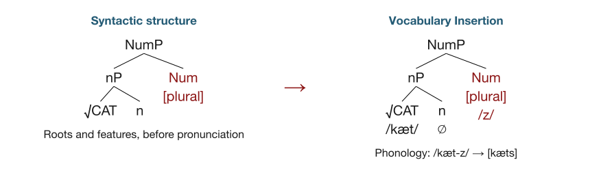{.dm-tree fig-alt="Before insertion, NumP contains nP with root CAT and n, plus Num plural. After insertion the same nodes receive kæt, zero, and z. Phonology yields cats."}

The hierarchy stays the same here. Pronunciation is supplied at PF.

::: {.notes}
Read this tree from the bottom up: √CAT combines with n; nP combines with
Num[plural]. The root is not itself a noun. The forms beneath the labels on
the right are annotations on the same terminals, not new syntactic daughters.
The tree is a noun-sized fragment, not a complete DP or sentence. Its visual
left-to-right arrangement anticipates English order; a full account must
specify linearization and affix attachment. /z/ devoices after /t/.

This is the baseline before we resume the unfinished slide from September 29.
See Harley & Noyer (1999), §§1 and 2, and Goryczka (2025), §3.2.
:::

## Why leave room for morphological operations?

Syntax and pronunciation may package features differently.

| Operation | What changes on the PF branch? |
|---|---|
| **Fusion** | Two terminals become one insertion site. |
| **Fission** | One terminal supports more than one insertion site. |
| **Impoverishment** | A feature is deleted before insertion. |

::: {.notes}
This resumes the slide with the same title in the previous deck. These are
postsyntactic operations on the pronunciation branch. Fission can be ordered
before or during Vocabulary Insertion, depending on the implementation.
The examples below illustrate analyses; a surface segmentation alone does
not establish an operation. Goryczka (2025), pp. 104 to 108; Harley & Noyer
(1999), §3. Allow about ten minutes for the three worked examples.
:::

## Fusion: two terminals, one insertion site

Italian **am-a-te**, ‘you.PL love’, present indicative.

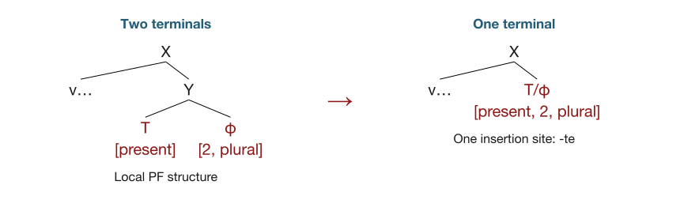{.dm-tree fig-alt="A local PF subtree with separate T present and phi second-person plural becomes a subtree with a single T/phi terminal carrying present, second person, and plural."}

The features survive; their **packaging** changes.

::: {.notes}
Simplified from Goryczka (2025), pp. 104 to 106, examples (50) and (51),
following Pomino (2008). φ stands for agreement features. X and Y only group
the local PF subtree; they are not extra pronounced morphemes. The v… branch
abbreviates the root, verbalizer, and theme vowel. Compare am-a-v-a-te,
‘you.PL loved / used to love’, where the imperfect has an overt tense exponent.

Do not infer Fusion merely because an ending is cumulative or present tense
has no separate sound. Zero exponence or spanning could offer other analyses.
This diagram makes the Fusion hypothesis explicit: two inputs become one
terminal, preserving their features.
:::

## Fission: one terminal, two insertion sites

**Toy paradigm:** one agreement bundle, two endings.

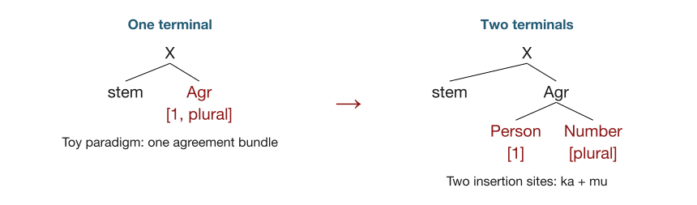{.dm-tree fig-alt="Agr first-person plural under X splits into Person first and Number plural, realized separately as ka and mu. This is an invented paradigm."}

**ka** ↔ [1st person] · **mu** ↔ [plural] → **stem-ka-mu**

::: {.notes}
Ka and mu are invented so students can see the mechanism without learning
another language's feature system. They are not claimed to be Italian
morphemes. The upper Agr on the right groups two output terminals; it is not
a third insertion site. Ask students to count the terminals before and after.

A natural-language proposal is Italian canta-ro-no, ‘they sang’, compared
with irregular corse-ro, ‘they ran’. Goryczka (2025), p. 106, example (52),
discusses a Fission account following Calabrese (2015). The Italian feature
analysis is more complicated than partitioning first person and plural.

Some implementations allow multiple insertions into a terminal with residual
features; others split the terminal before insertion. This is the latter
teaching schema. Two audible endings alone do not establish Fission: syntax
could have supplied two nodes in the first place.
:::

## Impoverishment: fewer features at PF

Spanish **le dio un libro**, ‘gave her a book’, but **se lo dio**, ‘gave it to her’.

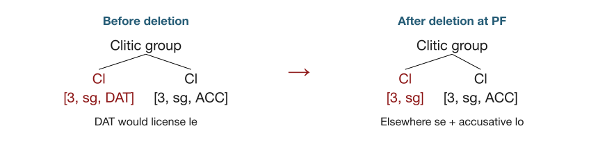{.dm-tree fig-alt="In a simplified Spanish clitic analysis, DAT is removed from the first clitic before an accusative clitic. Both nodes remain, but the first no longer licenses le; se appears instead."}

Delete **[DAT]** before an accusative clitic → **se lo**, not **\*le lo**.

::: {.notes}
Simplified teaching version of the spurious-se analysis discussed in Goryczka
(2025), pp. 107 to 108, examples (53) and (54), citing Harris (1994).
DAT means dative, ACC accusative. We restrict the illustration to third-person
singular clitics and suppress gender and the internal decomposition of the
clitics. Harris's analysis concerns the case-sensitive l- exponent; the
diagram abbreviates the resulting full forms as le and se. Analyses differ
over the feature geometry and whether l- realizes case or D.

The dative relation survives in interpretation. We did not delete the
recipient from the message or remove the clitic terminal. Impoverishment is
also different from inserting a silent exponent: it changes the features
available for Vocabulary Insertion. Underspecification instead changes what
a Vocabulary Item requires, without itself deleting a feature from the node.
:::

## What changed?

| | Terminal sites | Features at PF |
|---|---|---|
| Ordinary insertion | Same | Same |
| Fusion | Fewer | Combined |
| Fission, as drawn | More | Distributed across sites |
| Impoverishment | Same in our example | Reduced |

::: {.notes}
A Fusion analysis needs evidence that tense and agreement started in separate terminals
and that a single terminal is the right analysis of their realization.
Features could have been bundled already, or a Vocabulary Item could realize
a span. This comparison concerns the diagrams we just saw, not every
implementation of these operations.
:::

## Your turn: *record*

Keep a **record** of the meeting.

Please **record** the meeting.

1. Draw a syntactic tree for each use in DM.
2. State what is shared and what differs in the two structures.
3. Propose a rule for the pronunciation in each context, including stress.

::: {.notes}
Give pairs two minutes. Read both sentences aloud, but keep the answer on
the next slide. Ask for explicit n/v structure and a statement of what
conditions pronunciation. Students may use informal stress notation.
:::

## An answer: *record*

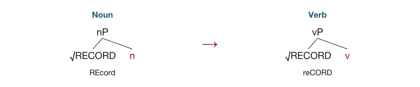{.dm-tree fig-alt="Root RECORD combines with n in the noun and v in the verb. The noun has initial stress; the verb has final stress."}

For **√RECORD**:

- In an **n** context, stress the first syllable: **REcord**.
- In a **v** context, stress the second syllable: **reCORD**.

The vowels also differ: /ˈrɛkɚd/ versus /rɪˈkɔɹd/.

::: {.notes}
The root identity is shared; the categorizing head differs. The pronunciation
statement is specific to this root, not a general rule for every English
noun and verb. Transcriptions illustrate common American pronunciations.
The category head has no separate segmental exponent in this example.

A context-sensitive stress rule plus vowel realization, or listed
contextual root allomorphs, could express the pattern. These two forms alone
do not choose between those implementations. Credit other trees if students
explain their categorial structure and realization assumptions.
:::

## Your turn: *separate*

The files are **separate**.

Please **separate** the files.

1. Draw a syntactic tree for each use in DM.
2. Identify the shared root and the different categorizing heads.
3. Propose a pronunciation rule for the final syllable. Does stress change?

::: {.notes}
Give pairs two minutes. Have students pronounce both forms before moving to
the answer. They should distinguish category, stress, and vowel quality.
:::

## An answer: *separate*

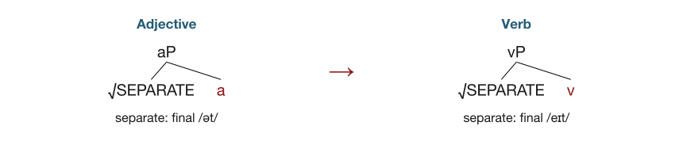{.dm-tree fig-alt="Root SEPARATE combines with a in the adjective and v in the verb. The adjective ends in schwa-t; the verb ends in ay-t."}

For **√SEPARATE**:

- In an **a** context, realize the ending as **/ət/**.
- In a **v** context, realize the ending as **/eɪt/**.

Both forms retain **initial primary stress**.

::: {.notes}
Some accents use /ɪt/ in the adjective. The adjective describes a state;
the verb describes bringing it about. These are abbreviated categorial trees.
The conditional pronunciation statement is specific to this root; do not
teach it as an unrestricted vowel rule for all adjectives and verbs.

The data can be expressed with category-conditioned root forms or suitable
morphophonological rules. The important result is that the pronunciation
mechanism can access the grammatical context built around the root.
:::

## Your turn: nominalizations

**arrive → arrival**

**collect → collection**

**destroy → destruction**

1. Draw a DM tree for each noun.
2. State a rule choosing the nominal suffix in each context.
3. Explain any changes needed in the stem or its pronunciation.

::: {.notes}
Allow three minutes. Ask students to distinguish suffix choice from stem
realization. They should not assume that a single instruction “make a noun”
fully determines the form. Accept a verbal layer below n if they explain it.
:::

## An answer: nominalizations

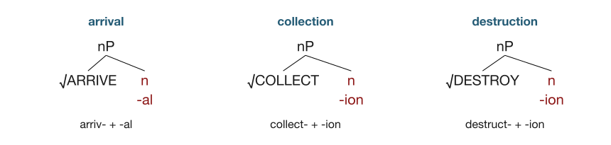{.dm-tree .compact-tree fig-alt="Nominal heads combine with ARRIVE, COLLECT, and DESTROY. Their suffixes are al, ion, and ion; DESTROY uses the stem destruct-."}

- **n → -al** with √ARRIVE; **n → -ion** with √COLLECT and √DESTROY.
- **√DESTROY → destruct-** in this nominal context.
- Stem-suffix phonology gives **collection** /kəˈlɛkʃən/ and
  **destruction** /dɪˈstrʌkʃən/.

::: {.notes}
These are root-conditioned realization statements. The minimal trees leave
open whether verbal structure intervenes below n. The stem alternation is
lexically restricted: appending -ion to the spoken form destroy is
insufficient. Both -ion forms also require the appropriate stem-suffix
phonology; written t + ion is not simply spoken /t/ plus /ion/.

Arrival likewise requires the appropriate nominal ending and phonological
realization. A complete account would state underlying forms and explicit
phonological rules. The exercise identifies which dependencies those rules
must capture, without choosing one analysis from these forms alone.
Harley & Noyer (1999), §1.3, discusses destroy/destruction.
:::

## Why connect DM to production?

Both accounts distinguish **building a grammatical representation** from
**giving it a pronunciation**.

| Production question | DM's resources |
|---|---|
| What gets selected? | Roots and grammatical features |
| How does it combine? | Syntax and morphological operations |
| How does it sound? | Vocabulary Insertion and phonology |

::: {.notes}
This is the central question for the rest of class. Return to the production
models students already know: conceptual preparation, grammatical encoding,
and phonological encoding. Pfau asks whether the representations and
operations of DM can do the work assigned to grammatical and phonological
encoding, while also explaining characteristic speech errors.

Source: Pfau (2009), as discussed in Goryczka (2025), §3.2.3. Pfau's earlier
thesis chapter 4 also introduces the connection through this distinction:
https://babel.ucsc.edu/~hank/mrg.readings/pfau-ch4.pdf.
:::

## DM inside the Formulator

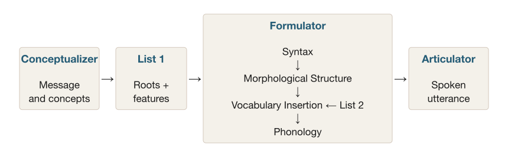{.dm-tree fig-alt="Conceptualizer activates roots and features in List 1. These feed the Formulator: syntax, Morphological Structure, Vocabulary Insertion using List 2, and phonology. The output passes to the Articulator."}

**DM supplies the Formulator's grammatical machinery.**

::: {.notes}
Simplified production route checked directly in Pfau (2000), chapter 5,
figures (5-1) and (5-4), PDF pages 295 to 310. The key identification of DM
with the Formulator is on PDF page 302. Compare the 2009 book discussion
summarized in Goryczka (2025), pp. 119 to 122, diagram (64). The diagram follows the
route toward pronunciation and omits the LF branch. List 2 supplies the
Vocabulary Items used at insertion; it is not itself an additional processing
stage. Pfau identifies the Encyclopedia with the conceptual network.

Pause on the central box: we are opening up the Formulator from the
production architecture, specifying the representations it manipulates.
Conceptual activation first selects roots and features from List 1; these
inputs enter syntax. The stores are not automatically serial processing stages.
:::

## What changes from a lemma-based account?

| A familiar production account | A DM production account |
|---|---|
| Select a lemma with grammatical properties. | Select an abstract root and grammatical features. |
| Use lexical information to build the utterance. | Combine roots with functional structure. |
| Retrieve the phonological form. | Insert exponents into the resulting structure. |

A **root** does not already contain its final category and inflected form.

::: {.notes}
Use Levelt as the familiar comparison. This table compares responsibilities;
it does not identify each DM object with a Levelt object. Levelt's lemma is
an abstract lexical representation with syntactic information. In the DM
version under discussion, √RECORD acquires its category in an n or v context,
as we just saw. A DM root is therefore not simply a renamed lemma.

Pfau's claim concerns the psychological use of grammatical representations.
The model still needs selection and ordering, but the grammar's own
operations can contribute to those processes. Refer back to record and
separate rather than introducing another theoretical framework here.
:::

## Late pronunciation still needs early root identity

Selecting **√KATZ** ‘cat’ is different from selecting a generic **ROOT** slot.

- The intended concept activates a particular root.
- Syntax combines that root with grammatical structure.
- Vocabulary Insertion supplies the appropriate pronunciation.

::: {.notes}
Pfau (2000), §4.2.1, “Non-Random Insertion: Distinguishing Cats from Dogs,”
checked directly; also discussed in Goryczka (2025), pp. 113 to 115.
The root notation identifies a specific abstract item; it is not an English
or German pronunciation stored in syntax. Conceptual distinctions must be
available early enough to guide which root enters the derivation. Otherwise
an input that only says ROOT plus animate would fail to distinguish cat
from dog. Once the root identity is selected, the cat and dog exponents are
not freely interchangeable candidates for that same root.
:::

## 1. Start with the message

We want to say: **Die Katzen schnurren.**  
‘The cats are purring.’

- We are talking about **cats**.
- There is **more than one**.
- The listener can identify **which cats**.
- They are **purring now**.

::: {.notes}
Start with the communicative intention. The written German sentence is our
target for the walkthrough, not an already selected word sequence in the
speaker's mind. Keep the target on the board through the derivation.

Pfau (2000), chapter 5, figure (5-1), PDF pages 295 to 302. Concepts such as
CAT, PURR, MULTIPLE, and DEFINITE become active. The temporal setting also
matters. The source treats this conceptual level as an interconnected network.
The small steps below unpack the analysis for teaching; they do not assert
that every Merge operation is a measured, separate processing stage.
:::

## 2. Select roots and grammatical features

| Contribution from the message | Input to grammatical encoding |
|---|---|
| Cats; purring | **√KATZ**, **√SCHNURR** |
| More than one cat | **[plural]**, associated with √KATZ |
| Identifiable referents | **D[definite]** |
| Present time in this example | **T[−past]** |

These are abstract inputs. Their pronunciations have not been inserted.

::: {.notes}
Conceptual activation selects specific roots and features from the input
store. Roots related to other active concepts could also become active, but
selection determines which ones enter the derivation. A functional head is
an abstract grammatical object, not yet a spoken function word or suffix.

The table lists the inputs relevant to the explanation, not a complete
numeration. The categorial heads n/v and clause structure are also needed.
√KATZ abbreviates the source's [root(katze)]; it does not assert that the
underlying pronounced stem lacks schwa. The root is also linked to feminine
gender, a lexical property not supplied by the intended number of cats.

We use nP and NumP to connect with the earlier classroom trees. The original
uses category-neutral LPs and licensing environments. This is a modernized
teaching decomposition, not a literal reproduction of figure (5-1).
:::

## 3. Build the nominal structure

Combine **√KATZ** with the nominal categorizer **n**.

{.dm-tree fig-alt="Root KATZ combines with n, highlighted in red, to form nP."}

The result is **nP**: a root in a nominal context.

::: {.notes}
Point to the root and then to n. The head n makes the nominal context
explicit in our teaching notation. No plural or definiteness has been added
to this small tree yet. The root's lexical identity is available even though
its pronunciation is not. The feature associated with the root in the
source includes feminine gender; we suppress it in the drawings because it
does not distinguish the plural determiner in this example.
:::

## 4. Add plural Number

Combine the nominal structure with **Num[plural]**.

{.dm-tree fig-alt="Num plural is added above the existing nP containing root KATZ and n."}

The structure now refers to multiple cats. **[plural]** is still a feature.

::: {.notes}
Keep the nP intact and point to the new red terminal. The source associates
plural with the nominal root; a separate Num head makes that specification
visible for teaching. Do not describe the new node as the sound -n. The
pronunciation will be supplied when the plural feature is realized in this
particular nominal environment.
:::

## 5. Add definiteness

Combine **D[definite]** with the plural nominal structure.

{.dm-tree fig-alt="D definite is added above the existing NumP, creating a DP for the identifiable plural cats."}

This **DP** identifies the cats the speaker is talking about.

::: {.notes}
D is the determiner head; DP is the larger phrase it heads. The English
paraphrase is “the cats,” but no German form has been inserted. D currently
contains the definiteness specification. The number information originates
in the nominal domain; a later morphological operation makes it available
on D for realization. This distinction explains why a single plural
interpretation can have consequences at multiple realization sites.
:::

## 6. Build the predicate and add its subject

Combine **√SCHNURR** with **v**, and place the cats' DP in the subject position.

{.dm-tree fig-alt="A vP contains the already built subject DP and a verbal structure made from root SCHNURR and v. A triangle abbreviates the subject's internal structure."}

The structure connects **who is purring** with **the purring event**.

::: {.notes}
The triangle abbreviates exactly the DP built in the preceding slides; it
is not a new indivisible word. The v′ branch contains the root and its verbal
licensing context. The subject is introduced in the specifier of vP.

Pfau's walkthrough assigns [+cause] to the light verb and takes it to
require a DP specifier. We show v and the subject relation, while suppressing
that internal feature. This is the analysis being illustrated, not a claim
that purring is an ordinary causative verb. The head-final arrangement here
prepares the explanation of German head movement.
:::

## 7. Add tense

Combine the predicate with **T[−past]**, appropriate to the present-time message.

{.dm-tree fig-alt="T minus past is added above the vP containing the subject DP and the purring predicate. T appears to the right before movement."}

The clause now contains both the event and its temporal specification.

::: {.notes}
The new T head supplies a grammatical temporal specification. The source
uses [-past]; in this example it supports a present-tense utterance. This is
not a claim that every nonpast form always refers to the present.

We have not inserted the German verb ending. Number on the subject and
tense in the clause are independently represented. T is shown head-final
before movement, following the structure used in the source's derivation.
:::

## 8. Establish the main-clause order

The verbal head raises through **v → T → C**. The subject DP moves to the front.

{.dm-tree fig-alt="In the resulting CP, the subject DP occupies the first position and C contains the complex verbal head root SCHNURR plus v and T. A lower TP contains unpronounced copies."}

Result: **subject DP + finite verbal head**.

::: {.notes}
Pfau (2000), chapter 5, figure (5-1), PDF pages 297 to 301. The root first
raises to v, then to T, then to C. The subject goes from SpecvP through
SpecTP to SpecCP. German main-clause V2 places the finite verbal head in C,
with one constituent before it. In this example that constituent is the
subject. It is one constituent, not necessarily one word.

The t labels stand for lower copies/traces, which are not pronounced here.
The diagram collapses the lower TP and movement details. It shows the final
positions, not a second construction of the subject or verbal root. No
phonological form has been inserted yet: syntactic movement determines the
configuration of abstract material that will later be pronounced.
:::

## 9. Add an agreement site

On the pronunciation branch, add **Agr**, an agreement terminal next to T.

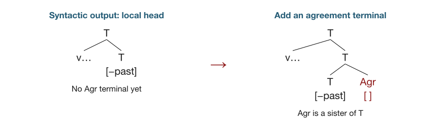{.dm-tree fig-alt="A local verbal head first has v and T minus past. Morphology adds an empty Agr terminal as a sister of T."}

There is now a place for the verb's agreement features.

::: {.notes}
Pfau (2000), figure (5-1), PDF pages 299 to 301. His label is AgrS for
subject agreement; the slides abbreviate it as Agr. This is morphological
insertion of a terminal, not Vocabulary Insertion of a sound. It precedes
the next step, which supplies the feature copied from the subject.

We have zoomed into the complex verbal head established by movement. The
v… branch abbreviates the lower root and verbalizer, and repeated T labels
indicate the local complex-head structure. The diagram is not a new full
clause or an extra position in the spoken sentence.
:::

## 10. Copy number; assign case

Copy **[plural]** from the subject onto **Agr** and **D**.

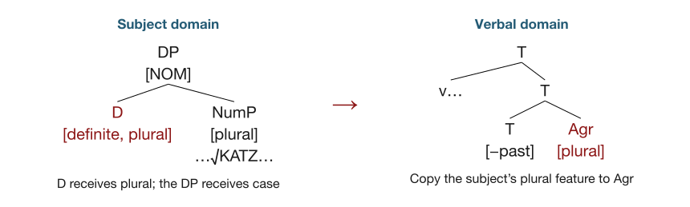{.dm-tree fig-alt="In the subject domain, D receives plural from the nominal structure and the DP has nominative case. In the verbal domain, Agr receives the subject's plural feature."}

The subject DP also receives **nominative case** from its clausal context.

::: {.notes}
Pfau (2000), PDF page 301. The arrow links the two domains by feature copy;
it does not mean that the subject tree is replaced by the verbal tree.
Number now matters in three places: the noun's number specification, the
determiner, and the agreement terminal. One plural meaning can therefore
control several pronunciations.

Nominative case is assigned to the subject DP; it is not copied from plural.
D's realization can refer to that nominative context. Feminine gender may
also be copied within the DP in the source, but it does not affect the choice
of die in this plural configuration. Keep the origin of each feature clear.
:::

## 11. Fuse tense and agreement

Combine the adjacent **T** and **Agr** terminals into one realization site.

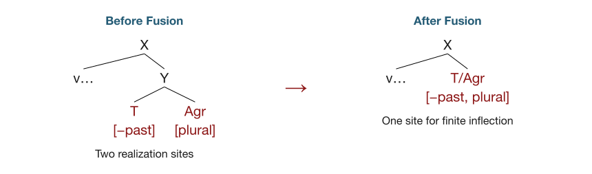{.dm-tree fig-alt="Separate T minus past and Agr plural terminals fuse into one T/Agr terminal containing both features."}

**[−past]** and **[plural]** both survive.

::: {.notes}
This is the Fusion proposal used in the walkthrough. Pfau (2000), PDF page
301, calls Tns/AgrS Fusion probable in the German present tense. The tree
illustrates that choice; the surface ending by itself does not establish it.
X and Y only group the local structure and do not add extra exponents.

Distinguish the last three slides: first create a site, then fill it with
agreement information, then combine it with T. Those are separate operations.
After Fusion, a suitable Vocabulary Item may realize the combined terminal.
Its specification can mention only a subset of the node's features.
:::

## 12. Insert the root pronunciations

The Vocabulary supplies forms for the selected roots in their grammatical contexts.

| Abstract root and context | Inserted form |
|---|---|
| √KATZ in the nominal context | **/katsə/**, *Katze* |
| √SCHNURR in the verbal context | **/ʃnʊr/**, *schnurr-* |

These pronunciations realize the roots that were selected earlier.

::: {.notes}
Pfau (2000), (5-2a,b), PDF page 301. The transcriptions follow his broad
forms, using modern IPA schwa. The actual German rhotic varies by speaker.
The lexical nominal form already ends in schwa. It is /katsə/ + /n/, not
/kats/ + the verbal suffix /ən/, that realizes the noun in this analysis.

Our n/v teaching heads have no separate audible exponent here. Context
restricts insertion, while the root index preserves lexical identity. The
noun and verb roots are not arbitrary placeholders filled only now by
whatever concept is most convenient.
:::

## 13. Realize the grammatical features

| Realization site | Exponent | Result |
|---|---|---|
| D[definite, plural], nominative context | **/diː/** | **die** |
| Nominal [plural], with √KATZ | **/-n/** | **Katze-n** |
| T/Agr[−past, plural], verbal context | **/-ən/** | **schnurr-en** |

The two plural endings have **different forms and different insertion contexts**.

::: {.notes}
Pfau (2000), (5-2c-e), PDF pages 301 to 302. The nominal plural item is
restricted to a class including Katze; he also notes the potential role of
the preceding schwa. Do not teach /n/ as the plural ending of every German
noun. The verbal item is specified for plural in a verbal environment; it
need not independently spell out every feature on the fused T/Agr node.

D has the copied plural feature, and insertion refers to the nominative
context of its DP. The noun's plural and the verb's agreement plural are
distinct sites related by feature copying. The same grammatical feature
therefore need not have one universal pronunciation.

Slides 12 and 13 separate the examples for exposition. They do not posit a
universal rule that every root is pronounced before every functional node.
:::

## 14. Prepare and articulate the sound sequence

**/diː/ + /katsə/ + /n/ + /ʃnʊr/ + /ən/**

↓

**Die Katze-n schnurr-en.**  
‘The cats are purring.’

Phonology organizes the spoken forms. The articulator executes the plan.

::: {.notes}
The plus signs display morphological assembly; pauses are not inserted
between these pieces. Pfau (2000), PDF page 302, gives a pronunciation with
schwas and notes variants involving schwa deletion and r-vocalization.
No special stem readjustment rule is needed for this example. Syllabification,
prosody, and articulation turn the phonological plan into an actual utterance.

Recap the dependency once: the message selected roots and features; syntax
combined them and established order; morphology added agreement, copied
features, and fused sites; Vocabulary Insertion supplied exponents for the
result. This explains what happens inside the Formulator. The sequence of
teaching slides is not a claim about separate measured time windows for
each operation.
:::

## Must planning follow the derivation?

We built **nP → NumP → DP**, then a clause, then movement.

**Does a speaker have to plan it in that order?**

Could planning begin with **where the constituents will end up**, with their
lower positions already linked to those destinations?

::: {.notes}
Return to the fourteen-step walkthrough. That sequence made the grammatical
analysis visible; it did not establish the time course of production.
Ask students to distinguish a grammatical derivation from an algorithm that
plans an utterance. This discussion proposes an alternative planning
implementation, not an additional claim attributed to Pfau.

Starting with a destination in a production plan does not mean that the DP
is syntactically base-generated there. The plan could anticipate a movement
chain whose grammatical analysis still includes lower positions.
:::

## Could a familiar frame be ready to reuse?

Suppose a speaker often uses this pattern:

**[subject DP] + [finite verb] + …**

Could its structure become familiar enough to retrieve as a frame, with
places for new roots and features?

**How much of the sentence would still need to be planned?**

::: {.notes}
The motivating intuition is idiom-like familiarity: perhaps a recurring
configuration can be reused without planning every structural relation anew.
This does not make the sentence a lexical idiom or require storing its words
as a fixed expression. Keep the claim conditional. No corpus estimate of
80 to 90 percent has been established for this pattern, and German clauses
do not all share the same surface order.

This frame is the subject-initial main-clause configuration already used in
the worked example. A planner would also need to select among alternatives
given the message, discourse, clause type, and predicate.
:::

## Plan the destination and its lower positions

Place the cats' **DPᵢ** at its planned destination; reserve its lower positions.

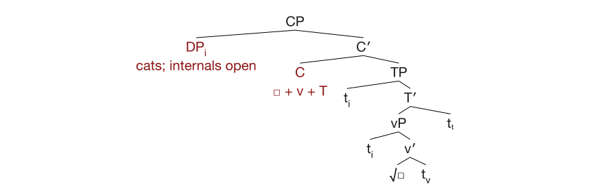{.dm-tree fig-alt="A proposed CP planning frame has a subject DP at the front and an unfilled verbal complex in C. Below C, TP contains a linked subject trace and T prime. Inside T prime, vP contains another subject trace and a verbal structure with an unfilled root and a lower v trace. A lower T trace is also reserved. The DP's internal structure remains unfilled."}

**Filled:** the subject's identity and destination. **Open:** internal content.

::: {.notes}
Read the tree from the planned destination downward. DPᵢ is the intended
cats phrase, eventually Die Katzen. Its D, Num, n, and root structure is
not yet expanded in this planning sketch. This is a partially specified
plan, not a finished DM representation or an already pronounced whole word.

The two tᵢ positions anticipate the subject chain through SpecTP and
SpecvP. The verbal destination anticipates root-to-v-to-T-to-C movement;
tᵥ and tₜ mark lower head positions. As in the earlier tree, complex-head
internals are abbreviated. The root slot still awaits lexical content.
Links identify positions in one dependency, not independent selections of
the cats or copies that must all be pronounced.

This deliberately rich candidate reserves a clause skeleton. The next slide
asks whether a speaker actually needs to reserve all of it at this point.
:::

## How much structure comes with a trace?

**Do we plan only the lower positions, or their surroundings too?**

| Possible plan | What is reserved in advance? |
|---|---|
| Dependency links | A destination and its linked lower positions. |
| Local structure | Those positions plus sisters, complements, and attachment sites. |
| A fuller frame | Clause structure, argument positions, and feature relations. |

Where would you leave the tree underspecified?

::: {.notes}
Ask students to erase parts of the preceding tree until they reach the
smallest plan they think would suffice. Distinguish an address for a future
position from an already constructed subtree at that position.

Make “complement” precise: a subject trace in SpecvP is not a head with
its own complement. We can ask whether its sister v′ is planned, and whether
the complements of heads along a verbal chain are planned. Depending on
the predicate, that might include an object position. Purring does not
itself require an object slot.

Also ask whether DP internals, argument roles, number, case, and agreement
links arrive with the frame or are supplied later. These are hypotheses
about the extent of advance planning, not three established processing stages.
:::

## What would distinguish these planning options?

Compare reuse of **surface order**, **movement dependencies**, and
**complement structure**.

- Would the same order help when the predicate needs different complements?
- Would a frame help before its roots and number features are selected?
- Which unfilled positions could remain open when speaking begins?

**A reusable plan must still supply what DM needs for realization.**

::: {.notes}
These are prompts for designing tests, not reported findings. A useful
comparison would vary lexical overlap, clause configuration, and predicate
argument structure separately as far as possible. Facilitation from repeated
word order alone would not establish a stored movement chain.

If teaching the later vector extension, return to this planning question: role addresses and dependency links could be available before their
content vectors are filled. A mere sequence of empty slots would not yet
encode all the hierarchical relations needed by the proposed DM analysis.
Agreement, contextual insertion, and morphological operations still require
appropriate structure and features by the time those operations apply.
Leave the amount and timing of advance planning as the question for discussion.
:::

## Now let something go wrong

Intended: **“I wanted to tie up the dog.”**  
Produced: **“I wanted to bark at the dog.”**

German: **anbind-en** ‘tie up’ → **anbell-en** ‘bark at’.

The concept **DOG** can activate a related, unintended action.

::: {.prompt}
Which part of the model needs access to these conceptual associations?
:::

::: {.notes}
Checked directly in Pfau (2000), §4.2.2, example (4-11a), PDF page 149.
Also reproduced from the 2009 book in Goryczka (2025), p. 113, (58b):
ich wollte den Hund anbellen instead of anbinden. This is a reported German
speech error; the English sentences translate the intended and produced
messages. The earlier DOG concept influences the later action, a semantic
perseveration. Pfau discusses it as a shift blend.

Use the error to motivate early conceptually guided selection: an unintended
root can enter the grammatical computation while the surrounding structure
still requires an infinitive. The semantic association cannot be explained
by matching morphosyntactic features to exponents alone. This is a different
problem from a purely sound-based slip.
:::

## A wrong root can get the right morphology

Intended: **versuchte … zu kommen**, ‘tried … to come’.  
Error onset: **kam**, ‘came’.

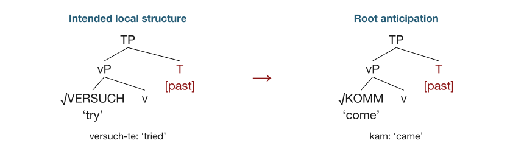{.dm-tree fig-alt="A simplified TP keeps T past fixed while root VERSUCH, try, is replaced by anticipated root KOMM, come. The resulting past form is kam."}

The displaced root is pronounced in its **new grammatical context**.

::: {.notes}
German spontaneous error from Pfau (2009), p. 17, repeated in Goryczka
(2025), pp. 118 to 119, (63a): wie immer kam er, äh, versuch-te er pünktlich
zu komm-en. The speaker repairs after kam er. Paraphrase: “As always, he
came, uh, tried to come on time.” The tree isolates the relevant local
structure, omitting the subject, infinitival clause, and movements.

First ask students what changed and what stayed. The intended finite root
√VERSUCH is replaced by anticipated √KOMM, while past remains. Only then
ask them to explain why the output is kam. In Pfau's analysis, insertion
followed by a past-sensitive readjustment gives the irregular form.
:::

## What exactly was left behind?

| | Root in the finite position | Past realization |
|---|---|---|
| Intended | √VERSUCH ‘try’ | versuch-**te** |
| Error | √KOMM ‘come’ | **kam** |

The stranded element is **[past]**. Its pronunciation depends on the root
that occupies the context.

::: {.prompt}
Why would “the speaker just kept the suffix *-te*” miss the pattern?
:::

::: {.notes}
Allow two minutes. There is no -te in kam. The invariant is an abstract
grammatical feature, not a phonological suffix. This is the central payoff
of separating roots, features, and exponents. An account in which an
already pronounced stem is placed next to a fixed -te suffix would need
additional machinery to produce the observed irregular past.

Pfau takes the altered root-feature combination as the input to ordinary
realization. Do not identify feature stranding with Impoverishment: past
remains here; nothing in this example deletes it. Source: Goryczka (2025),
pp. 117 to 119, following Pfau's feature-stranding and accommodation analyses.
:::

## A root can also land in a new category

Intended: **einen Blick geworfen**, ‘thrown a glance’.  
Produced: **einen Wurf geblickt**, approximately ‘glanced a throw’.

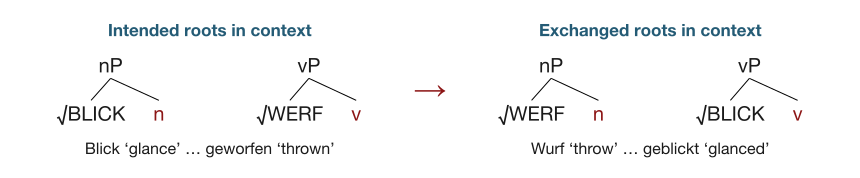{.dm-tree fig-alt="The intended nominal root BLICK and verbal root WERF exchange contexts. WERF under n is realized as Wurf; BLICK under v receives the participial realization geblickt."}

::: {.notes}
Checked directly in Pfau (2000), §4.5.2, example (4-55b), PDF page 231.
Also reproduced in Goryczka (2025), p. 119, example (63c): ich habe einen Wurf geblickt for ich habe einen Blick geworfen.
The odd English rendering makes the exchanged content visible; the idiomatic
meaning of the target is “I cast a glance.”

The diagram shows only the categorizing contexts. Participle structure,
case, determiner, and auxiliary are omitted. These are not noun and verb
labels traveling with completed words: in Pfau's analysis the roots occupy
new n/v environments. The nominal realization Wurf and verbal realization
geblickt follow from those contexts. The dissertation also discusses
complications for this example under a richer analysis of nominalizations
in §4.5.3, PDF pages 239 to 240; the slide illustrates the simpler licensing
analysis in §4.5.2, not a settled account of all nominal structure. Connect directly to record and the
nominalizations from the opening exercises.
:::

## The grammar keeps working after an error

| Altered representation | Ordinary grammatical consequence |
|---|---|
| √KOMM in a past context | Past realization: **kam** |
| √WERF in a nominal context | Nominal realization: **Wurf** |
| √BLICK in a participial verbal context | Participial realization: **geblickt** |

**Accommodation:** the produced form fits the context created by the error.

::: {.notes}
Pfau's argument is that these accommodations can result from normal
realization, licensing, feature copying, and readjustment. We need not add
an independent repair routine that first recognizes a completed wrong word
and then makes it grammatical. This is distinct from the speaker's overt
self-correction, such as saying “uh” and restarting after kam.

Pfau (2000), §4.7.1, “Against Repair Strategies,” checked directly in the
full dissertation. Goryczka (2025), pp. 118 to 120, summarizes the argument
from the 2009 book. This is an account of these cases, not a guarantee that every error
is accommodated or a proof that DM is the only possible explanation.
:::

## Your turn: roots, tense, and pronunciation

| | Finite position: past | Infinitival position |
|---|---|---|
| Intended | **schien** ‘seemed’ | **zu drohen** ‘to threaten’ |
| Produced | **drohte** ‘threatened’ | **zu scheinen** ‘to seem’ |

1. What moved between the two positions?
2. What stayed in the finite position?
3. What determines the two new pronunciations?

::: {.notes}
Give pairs three minutes, then reconstruct the derivation together. The
reported German error is es drohte zu scheinen for es schien zu drohen,
Pfau (2000), §4.6, example (4-68a), checked directly. Also reproduced from
the 2009 book in Goryczka (2025), p. 117, example (61b).

Answer: √SCHEIN and √DROH exchange; the past specification remains in the
finite context, while the other position remains infinitival. √DROH gets
regular -te in the finite context. √SCHEIN now has the infinitival realization
scheinen rather than the irregular past schien. The error is not an exchange
of the complete surface strings schien and drohen. Draw two local trees,
keeping T[past] fixed and exchanging only the roots.
:::

## What does this architecture explain?

- **Selection:** the message activates specific abstract roots and features.
- **Combination:** syntax places roots in grammatical contexts.
- **Realization:** ordinary morphology produces context-appropriate forms,
  even when an earlier choice was wrong.

::: {.prompt}
Explain *kam* using these three steps. Where did the error occur?
:::

::: {.notes}
Use this as the conceptual checkpoint. In this analysis the root anticipation
occurs before realization. The subsequent morphological output can be
well-formed relative to that altered representation. The observed outcome
constrains the ordering and units of processing.

Pfau offers more than a list of boxes: the separation between abstract
structure and pronunciation does explanatory work on particular errors.
However, these analyses do not by themselves predict exact error frequencies
or reaction times. Other architectures could implement comparable
representational distinctions. A surface error also need not always reveal
its locus without additional evidence.
:::

## Do roots and features need separate stores?

A speaker can produce the wrong root with the intended inflection, or the
intended root with the wrong inflection.

| Resource | What it supplies |
|---|---|
| Root store | Lexical content |
| Feature store | Grammatical specifications |
| Vocabulary | Phonological exponents |

Independent errors can motivate **separate representations**.

::: {.notes}
Goryczka (2025), §6.1, pp. 269 to 278; compare §3.2.3 on Pfau. Her four-list
architecture follows De Belder & Don (2022): List 1 features, List 2 roots,
List 3 Vocabulary Items, List 4 Encyclopedia. The Conceptual Network guides
initial selection; the Encyclopedia contributes conventional interpretations.

This extends the same central question about how speakers use a DM grammar.
It is not a reason to identify aphasic substitutions with occasional slips:
the populations and causes of errors differ. Independent root and feature
errors motivate representational distinctions, but do not establish
anatomically separate stores.
:::

## Revising a developing utterance

**“The girl reads … writes a letter.”**

::: {.production-flow}
Conceptual planning ⇄ DM formulation ⇄ Local phonology → Articulation
:::

**Cognitive control** can influence selection, mapping, and revision.

::: {.prompt}
Which choice could be revised while the rest of the structure stays available?
:::

::: {.notes}
Goryczka's example is La ragazza legge [/] scrive una lettera, §6.1,
pp. 270 to 271. A possible correction changes the selected root/concept while
retaining a transitive structure. The figure is a simplified map of the
connections in Figure 44, not a reproduction of every arrow. Control can
intervene from conceptual planning through articulation.

Her model also allows Vocabulary Insertion over individual terminals or
stored spans. Keep that point in reserve if students ask how frequent forms
might be accessed. Spanning does not require merging terminals as Fusion
does. These feedback and control proposals are not a fitted activation
simulation. The ability to self-correct does not by itself establish Dell's
specific automatic feedback mechanism.
:::

## Exit ticket

1. Where does **DM** fit into this production architecture?
2. Why must a root's **identity** be available before its pronunciation?
3. In **versuchte → kam**, what changes and what stays?
4. Why can the error's morphology follow from **ordinary realization**?

::: {.notes}
Allow three minutes. Answers: DM supplies the Formulator's grammatical
machinery; the message must select a specific abstract root; √VERSUCH is
replaced by √KOMM while past remains; the new combination undergoes the same
context-sensitive insertion/readjustment as a correctly selected one.

This is the end of the main lesson. The references are followed by a
separate vector/LLM extension, which can be saved for another discussion.
:::

## Sources: DM and production {.smaller}

- **Pfau (2000).** [*Features and Categories in Language Production*.](https://dingo.sbs.arizona.edu/~hharley/courses/535/PfauThesis.pdf) Dissertation, Goethe University Frankfurt. Chapters 4 and 5.
- **Pfau (2009).** [*Grammar as Processor: A Distributed Morphology Account of Spontaneous Speech Errors*.](https://doi.org/10.1075/la.137)
- **Goryczka (2025).** *Grammar theory and language pathology: A Distributed Morphology account of verb production in aphasia*. §3.2.3 on Pfau; §6.1 on DMPAM. Course reading on ELMS.
- **Harley & Noyer (1999).** [“State-of-the-Article: Distributed Morphology.”](https://dingo.sbs.arizona.edu/~hharley/PDFs/HarleyNoyerDM1999.pdf)

::: {.notes}
The core architecture and selected examples were checked directly in the
full Pfau (2000) dissertation. Section and example numbers are the most
reliable locators: this PDF's body pagination differs from its table of
contents. The 2009 book references and kam/versuchte example were consulted
through Goryczka §3.2.3, not independently checked in the full 2009 book.
The opening morphology review also draws on Goryczka pp. 104 to 108 and
Harley & Noyer §3. The drawings are simplified teaching illustrations.
:::

## Further reading: possible implementations {.smaller}

- **Marcus (2013).** “Evolution, memory, and the nature of syntactic representation.” In *Birdsong, Speech, and Language*, pp. 27 to 40.
- **Keshev et al. (2025).** [“A working memory model of sentence processing as binding morphemes to syntactic positions.”](https://doi.org/10.1111/tops.12780)
- **Dell (1986).** [“A spreading-activation theory of retrieval in sentence production.”](https://doi.org/10.1037/0033-295X.93.3.283)
- **Caramazza (1997).** [“How many levels of processing are there in lexical access?”](https://cogneuro.psychology.fas.harvard.edu/publications/how-many-levels-processing-are-there-lexical-access)

## Extension: the same derivation in vectors

**Die Katzen schnurren.**

- Maintain small pieces of structure, such as the **subject DP** and the
  **finite verbal head**.
- Give roots and features **content vectors**.
- Bind those vectors to **positions within the structure**.

The representations can be numerical while retaining grammatical distinctions.

::: {.notes}
This extension follows the reading slides and can be taught separately from
the main class. It develops a possible implementation, not a model already
shown to reproduce the entire DM derivation.

Marcus (2013) motivates locally coherent treelets and fallible links between
them. Keshev et al. (2025), §2, supplies an associative item-position memory
using vectors. Here we adapt those ideas to the same German sentence. Marcus
does not supply the vector algorithm; Keshev does not implement DM operations
or a complete production system. Small local binding memories can be used
instead of assuming that one perfectly accessible matrix holds a whole
sentence. The precise fragment boundaries remain a model choice.
:::

## A position is a role in the tree

{.dm-tree .compact-tree fig-alt="A local tree for the nominal KATZ root labels NumP with the root address epsilon, nP with L, Num plural with R, KATZ with LL, and n with LR."}

**ε** = root position · **L** = left branch · **R** = right branch

Bind a node's **content** to its **path**. The same root could occupy a different path.

::: {.notes}
This is the local nominal fragment of the German sentence. The schematic
path code is our teaching construction. Internal-node labels must be stored
as well as terminal labels if the goal is to reconstruct the full labeled
tree. Path prefixes identify parent-child relations: LL and LR descend from L.
Different occurrences of the same root require different positions.

Path roles require a systematic encoding for larger structures. Exact
orthogonality for unboundedly many paths is impossible in a fixed finite
vector space. Encoding a finite tree is possible; reliable access under
memory limits is a separate question. This preserves Marcus's motivation.
:::

## Bind content; retrieve with a position

$$
W = \sum_i \mathbf{v}_i\mathbf{p}_i^{\mathsf T}
\qquad
\widehat{\mathbf{v}}_i = W\mathbf{p}_i
$$

**$\mathbf{v}_i$:** what occupies a node. **$\mathbf{p}_i$:** where it belongs.

| In our utterance | Content to bind |
|---|---|
| Subject's nominal root position | √KATZ |
| Subject's Number position | [plural] |
| Finite head's verbal root position | √SCHNURR |
| Tense position | [−past] |

::: {.notes}
Keshev et al. (2025), equations (6) and (7), motivates the encoding/retrieval
operation. We have set encoding strength to one and summed the updates.
W is temporary memory for the current structure, not the model's permanent
Vocabulary and not a claim about an LLM's trained weight matrices.

The four rows are examples, not the complete tree: D, categorizers, internal
nodes, and the added Agr position must also be encoded. Roles such as
“subject's Number” abbreviate addresses in the current syntactic structure.
If the position vectors are orthonormal, the simple lookup is exact. With
similarity, W p_i includes contributions from other bindings, creating
interference. A matrix is an order-two tensor; flattening it preserves its
entries, so the entire binding memory also has a vector representation.

Our separated terminal bindings extend the paper's implementation. The paper
concatenates root and number subvectors in an item representation; it does
not prescribe this particular DM tree encoding.
:::

## A numerical example: copy plural to agreement

Columns are **Num** and **Agr**. Rows are **plural** and **nonpast**.

$$
W_{\text{before}}=
\begin{bmatrix}1&0\\0&0\end{bmatrix}
\quad\longrightarrow\quad
W_{\text{after}}=
\begin{bmatrix}1&1\\0&0\end{bmatrix}
$$

Cue the Agr column:
$W_{\text{after}}\begin{bmatrix}0\\1\end{bmatrix}
=\begin{bmatrix}1\\0\end{bmatrix}$ → **[plural]**.

Number remains on the noun and is now available for verbal agreement.

::: {.notes}
This is an explicit two-role slice of the larger memory, using basis vectors
for the two positions. It omits roots, D, and T. The nonpast row is zero in
this slice because neither of these two sites contains tense before Fusion;
nonpast is stored at the separate T position elsewhere in the memory.

The new binding is W += v_PL p_Agr^T. That copies the plural feature without
deleting the source binding to Num. Copying to D could be another update.
The numerical construction is ours, not a simulation from Keshev et al.
It presupposes a grammatical operation selecting the correct source and
recipient; the outer product alone does not decide when agreement applies.
:::

## Morphological operations become changes to bindings

| DM operation | One possible operation on the code |
|---|---|
| **Fusion** | Replace two terminal bindings with one combined feature bundle. |
| **Fission** | Rebind specified parts of one bundle to separate terminals. |
| **Impoverishment** | Remove a specified feature from a PF-side content vector. |

For our verb: **T [0, 1] + Agr [1, 0] → T/Agr [1, 1]**.

::: {.notes}
The two coordinates here are plural and nonpast, as on the previous slide.
Now we bring in the separate T binding. A toy Fusion implementation removes
the T and Agr bindings, creates a new T/Agr role, and binds [1,1] to it.
A mere sum of content vectors without changing the realization sites would
not implement Fusion. Use disjoint feature coordinates for this toy sum;
arbitrary learned vectors cannot be combined meaningfully without specifying
the code and operations.

Fission requires a rule specifying the new sites and feature allocation.
Impoverishment can use a projection or mask that removes a coordinate in
this toy code. It must apply to the PF representation while preserving
information needed for interpretation. General learned representations may
require nonlinear operations. These are explicit implementation proposals,
not operations demonstrated by the memory paper or by an LLM experiment.
:::

## Retrieve the bindings and realize them

| Retrieved content and context | Vocabulary result |
|---|---|
| √KATZ, nominal context | /katsə/ |
| [plural], at this nominal site | /n/ |
| √SCHNURR, verbal context | /ʃnʊr/ |
| [plural], at fused T/Agr | /ən/ |

Together with **D → /diː/**: **Die Katzen schnurren.**

::: {.notes}
Keep memory and Vocabulary distinct. Retrieval recovers roots and features;
a context-sensitive realization mechanism chooses exponents. A vector for
plural is not itself the sound /n/ or /ən/. The remaining D binding includes
definiteness and copied plurality, with nominative supplied by the DP context.

To make this a production model, add explicit activation, selection, timing,
and monitoring mechanisms. Dell-style activation or a Caramazza-style
separation of information types offers possible starting points, but they
are distinct architectures with commitments that must be chosen explicitly.

This implementation could represent a root substitution without overwriting
tense, or a feature change without overwriting the root. Reproducing the
frequency and timing of observed errors would require further mechanisms
and empirical fitting. No fitted simulation is being reported here.
:::

## Could an LLM contain comparable information?

**Two things to look for:**

- A **direction or subspace** that distinguishes a grammatical feature
  across many different words.
- **Attention-head outputs or other components** that help use that
  information when predicting a form.

A syntactic head such as **Num** and an **attention head** are different kinds of object.

::: {.notes}
This begins an experiment proposal for a German-capable model whose internal
activations and component outputs can be inspected. Use a fixed checkpoint
and tokenizer. An LLM is not assumed to have explicit DM terminals, the toy
matrix W, or a planning pipeline identical to a human speaker's.

The proposal is motivated by primary work on grammatical-number interventions
(Lasri et al., 2022), multilingual agreement neurons (Mueller et al., 2022),
and naturalistic morphosyntactic interventions (Amini et al., 2023). These
studies motivate methods, not a claim that DM has already been found in an
LLM. Head outputs, residual representations, and feed-forward components may
all participate; a grammatical feature need not have a single dedicated head.
Sources are collected at the end of this extension.
:::

## Begin with controlled morphological contrasts

| Number | Prefix | Candidate continuation |
|---|---|---|
| Singular | **Die Katze** | **schnurrt** |
| Plural | **Die Katzen** | **schnurren** |
| Singular | **Der Hund** | **bellt** |
| Plural | **Die Hunde** | **bellen** |

Train an analysis on some roots; test it on **different roots and forms**.

::: {.notes}
Expand these illustrative pairs into a balanced stimulus set. Within each
pair, hold lexical content constant while varying number. Include multiple
noun and verb paradigms, matched lengths where possible, and counterbalanced
semantic contexts. The Hund pair changes the determiner as well as the noun;
control or stratify determiner cues instead of attributing their contribution
to noun morphology. The Katze pair has the same surface die in both numbers.

Collect activations at aligned structural positions, such as the final
subject token, once the number information is available. A causal model
cannot use a following noun's number at an earlier determiner position.
Subword tokens are not morphemes: align whole words and record segmentation.
Evaluate full candidate continuations, including a word boundary, when they
span multiple tokens. Do not assume -n or -en is a single token.

Split by noun and verb roots, not random sentences, and test across tenses
and suffix patterns. Include cues to tense when testing tense itself. This
helps distinguish grammatical generalization from memorized endings.
:::

## Find a candidate number direction

At layer $\ell$, compare paired representations:

$$
\mathbf{d}_{\ell}=\operatorname{mean}_{\text{pairs}}
\left(\mathbf{h}_{\ell,\mathrm{PL}}-
\mathbf{h}_{\ell,\mathrm{SG}}\right).
$$

Can a simple readout recover **number** for roots it has never seen in training?

Then ask which **head outputs and layers** carry or transform that information.

::: {.notes}
This mean-difference direction is a concrete starting hypothesis. Also fit a
regularized linear probe and compare it with simple baselines. It is not
a guarantee that the feature has one global linear direction. Extract
representations at matched positions after the subject, with consistent
word/token alignment, and use disjoint roots in held-out evaluation.

A successful probe establishes decodability. It could be exploiting suffix,
determiner, lexical, or position cues rather than a reusable morphological
representation. Use the controls on the previous slide, label-shuffled
baselines, and comparisons across forms. Do not equate one successful
classifier weight vector with a unique underlying feature in the model.

Structural probes, such as Hewitt & Manning (2019), offer a related test for
recoverable tree relations. Their result concerns a learned readout of
representations, not a demonstration that a model executes DM derivations.
:::

## Change the candidate; measure the form choice

1. Run singular and plural prefixes and save their activations.
2. Patch a candidate **head output or feature subspace** from the plural run
   into the singular run at the matched position.
3. Recompute the continuation probabilities.

Does preference shift from **schnurrt** toward **schnurren**?

::: {.notes}
This is an intervention proposal, not an experiment we have run. Patch a
single candidate at a time initially and recompute downstream states, rather
than editing a cached vector after its consequences have already been used.
Compare changes in log P(schnurren plus boundary | prefix) minus
log P(schnurrt plus boundary | prefix). Sum token log probabilities for
multi-token forms; keep the same candidate pair before and after intervention.

Use same-root number pairs, reverse-direction patches, unchanged-number
patches, and matched control heads/directions. Test whether the effect
transfers to held-out verbs and preserves unrelated lexical distinctions.
A selective effect is more informative than a broad loss of model accuracy.
Raw attention weights alone do not establish that a head is causally using
number. Ablation can be a complementary test, but redundancy can hide a
component's contribution. Interventions may also create unnatural states.

Lasri et al. (2022) motivates testing number usage rather than decodability
alone; Mueller et al. (2022) and Amini et al. (2023) supply related causal
methods for agreement and morphosyntax. Our German-prefix design is an
adaptation, not a reproduction of their experiments.
:::

## What would connect the findings back to DM?

| Finding | What it would support |
|---|---|
| Number can be decoded across roots. | A reusable grammatical distinction. |
| A selective intervention changes inflection. | That information contributes to form choice. |
| The same feature predicts different exponents in different contexts. | Context-sensitive realization. |

Identifying **Fusion, Fission, or Impoverishment** would require additional,
operation-specific tests.

::: {.notes}
The important next contrast is feature identity versus exponent identity:
plural can correspond to different nominal endings and to agreement on a
verb. A useful analysis should test both shared grammatical information and
context-specific realization, including controls for token identity.

Feature decodability and causal influence are not enough to distinguish DM
from other theories with grammatical features and contextual form selection.
For Fusion, for example, we would need independently motivated separate input
sites and evidence for their combination before a joint realization. A
single “plural head” or embedding direction would not establish that.
The extension proposes tests and a possible implementation; it reports no
newly measured LLM results.
:::

## Sources for the vector and LLM extension {.smaller}

- **Marcus (2013)** and **Keshev et al. (2025)**: local structural memory and
  item-position binding, listed above.
- **Hewitt & Manning (2019).** [“A Structural Probe for Finding Syntax in Word Representations.”](https://aclanthology.org/N19-1419/)
- **Lasri et al. (2022).** [“Probing for the Usage of Grammatical Number.”](https://aclanthology.org/2022.acl-long.603/)
- **Mueller, Xia, & Linzen (2022).** [“Causal Analysis of Syntactic Agreement Neurons in Multilingual Language Models.”](https://aclanthology.org/2022.conll-1.8/)
- **Amini et al. (2023).** [“Naturalistic Causal Probing for Morpho-Syntax.”](https://aclanthology.org/2023.tacl-1.23/)
